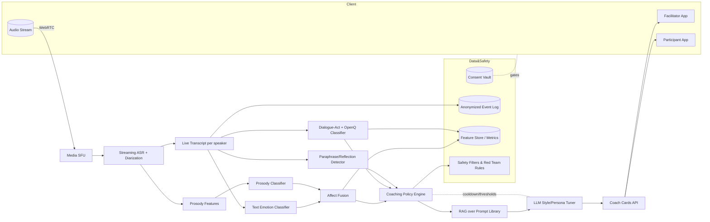

# AI Platform Recomendation

Owner: Miron Krokhmal

Here’s a focused blueprint for an AI platform that excels at **emotional sensing, active listening, asking open questions, and delivering reflective prompts**—optimized for live facilitation and follow-ups.

# What to build (capabilities → signals → models → targets)

| Capability | Primary signals | Model approach | Output (per turn / rolling) | Real-time target |
| --- | --- | --- | --- | --- |
| **Emotional sensing** | Text (lexical cues), audio prosody (pitch F0, energy, speaking rate), silence/overlap; *(opt-in video later)* | Text emotion/affect classifier (fine-tuned transformer on GoEmotions-style labels + valence/arousal); prosody features (openSMILE/pyannote) → shallow classifier; optional fusion (late fusion) | `affect_vector={valence, arousal, engagement}`, `tension_score`, `confidence` | Features ≤250ms; affect update ≤1s |
| **Active listening detection** | Dialogue acts, paraphrase similarity, minimal encouragers (“mm-hmm”, “I hear…”) | Dialogue-act classifier + paraphrase (SBERT-style) + rules for encouragers | `active_listening_score`, detected behaviors (reflect, paraphrase, validate) | Turn+200ms |
| **Open-question detection** | Question form, intent | Lightweight classifier + LLM verifier for edge cases | `open_q_ratio`, flags for closed/leading | Turn+100ms |
| **Reflective prompt generation** | Session goals + current affect + last turns | Retrieval-augmented generation (prompt library) + LLM style tuner + safety filters | 1–2 **contextual** prompts with difficulty ladder & phrasing variants | ≤800ms |
| **Facilitator nudges** | Combined above | Policy engine (thresholds, cooldowns, user prefs) | Non-intrusive cards: “Try an open ‘how’ here?” | UI push ≤200ms |
|  |  |  |  |  |

**Key idea:** use a **hybrid** stack—fast classifiers for detection + an LLM for wording and reasoning. Keep a **policy layer** that decides *when* to intervene (to avoid over-coaching).

## 2) Reference architecture (runtime)

**Latency budget (end-to-end nudge):** ~600–900 ms on average; never nudge more than every 20–30 s unless high-tension detected.

# 3) Data & prompt strategy

- **Prompt Library (curated):** open questions (why/how/what), reflective/paraphrase templates, scaling questions, strengths spotting, future-oriented prompts. Tag each with: *goal*, *tone*, *difficulty*, *audience*, *contra-indications*.
- **Conversation State:** rolling window of last 6–10 turns + `affect_vector` history; store *intent*, *topic*, *risk flags* (e.g., acute distress → safety playbook).
- **Consent & privacy:** explicit toggles per session: transcripts on/off, audio prosody on/off, video on/off. Tokenize PII; retention windows by customer tier.
- **Labeling playbook:**
    - Utterance schema: `{speaker, text, start_ms, end_ms, acts[], affect, is_open_q, has_reflection}`
    - Dual-annotator + adjudication for training; compute inter-rater agreement (κ).

---

# 4) Guardrails & ethics (non-negotiables)

- **Scope:** facilitation/coaching support—not clinical diagnosis. Clear UI copy + escalation options.
- **Safety filters:** self-harm, harassment, medical/financial advice → *halt + recommend human escalation*.
- **Bias checks:** evaluate open-question and reflection scores across genders/accents/languages; calibrate prosody models per locale.

---

# 5) Metrics you’ll watch

- **Quality:** facilitator CSAT on nudges, *prompt acceptance rate*, post-session usefulness rating.
- **Behavioral:** *open-question ratio*, *reflection frequency*, talk-time balance, interruption rate, silence distribution.
- **Affect dynamics:** variance in `affect_vector`, “tension spikes” resolved within N turns.
- **Model:** precision/recall on act & open-question detection; WER for ASR; latency SLO for nudge loop.

---

# 6) Tech choices (vendor-agnostic, GCP-friendly)

- **Streaming ASR + diarization:** managed STT with word-timings; Whisper-class fallback for offline.
- **Prosody:** openSMILE/pyannote features → small on-CPU classifier (fast).
- **Text classifiers:** RoBERTa/DeBERTa fine-tunes for emotion & dialogue acts (serve on CPU/GPU via TorchScript or TF-Serving).
- **LLM:** one strong general model with a *facilitator persona*; RAG grounded on your library; temperature ladder for reflective prompts.
- **Pipes:** WebRTC → SFU; events via Pub/Sub; workers on Cloud Run Jobs; analytics to BigQuery; features in Feast (later).
- **Storage:** Postgres (RLS) for session state; GCS for artifacts; Consent Vault as separate schema/service.

---

# 7) Phased rollout

1. **Week 0–6: MVP**
    - Streaming ASR, open-question detector, prompt library + RAG, basic reflective prompts, opt-in nudges.
2. **Week 6–12:**
    - Prosody-based affect fusion, active-listening detector, policy cooldowns, facilitator controls, post-session summaries.
3. **Week 12+:**
    - A/B prompt variants, multilingual, opt-in video affect, feature store + periodic fine-tuning.

---