# AI Developer Introduction Overview
## Points of You AI Studio

## Executive Summary

Welcome to the Points of You AI Studio project! As the AI Developer, you'll be responsible for creating the intelligent backbone of a revolutionary digital coaching platform that combines the proven Points of You methodology with cutting-edge AI technology. This document provides a comprehensive overview of your role, the AI architecture you'll build, and the innovative learning systems that will make this platform uniquely effective.

## Project Context and Vision

Points of You AI Studio transforms traditional facilitation into an AI-enhanced experience while preserving the methodology's core values of reflection, connection, and personal insight. Your AI systems will:

- **Enhance Human Connection**: Support facilitators with intelligent nudges and insights
- **Personalize Learning**: Adapt to individual participant needs and preferences  
- **Preserve Methodology**: Maintain POY's proven psychological frameworks
- **Enable Scale**: Allow quality coaching experiences for larger audiences
- **Continuous Improvement**: Learn from every interaction to become more effective

## AI System Architecture Overview

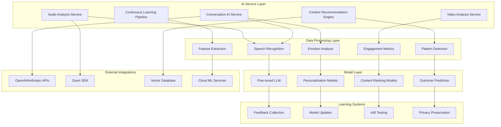

## Your Development Journey: 12-Week Timeline

### Phase 1: Foundation (Weeks 1-2)
**AI Architecture and Conversation AI**

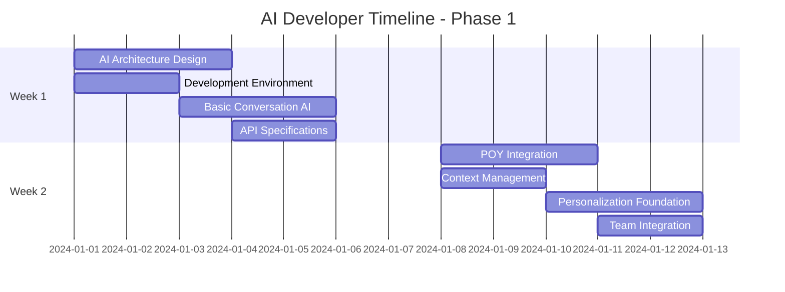

**Key Deliverables:**
- AI development environment with MLflow/Weights & Biases
- Basic conversation AI using OpenAI/Anthropic APIs
- POY-specific prompt templates and response generation
- Context-aware conversation management system

### Phase 2: Content Intelligence (Weeks 3-4)
**Recommendation Engine and Audio Processing**

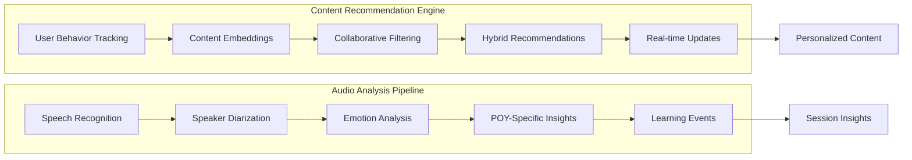

**Key Deliverables:**
- Vector database integration for semantic content search
- Hybrid recommendation system with A/B testing
- Audio processing pipeline with Whisper integration
- POY-specific speech analysis and insight detection

### Phase 3: Multimodal Analysis (Weeks 5-6)
**Video Processing and Advanced Analytics**

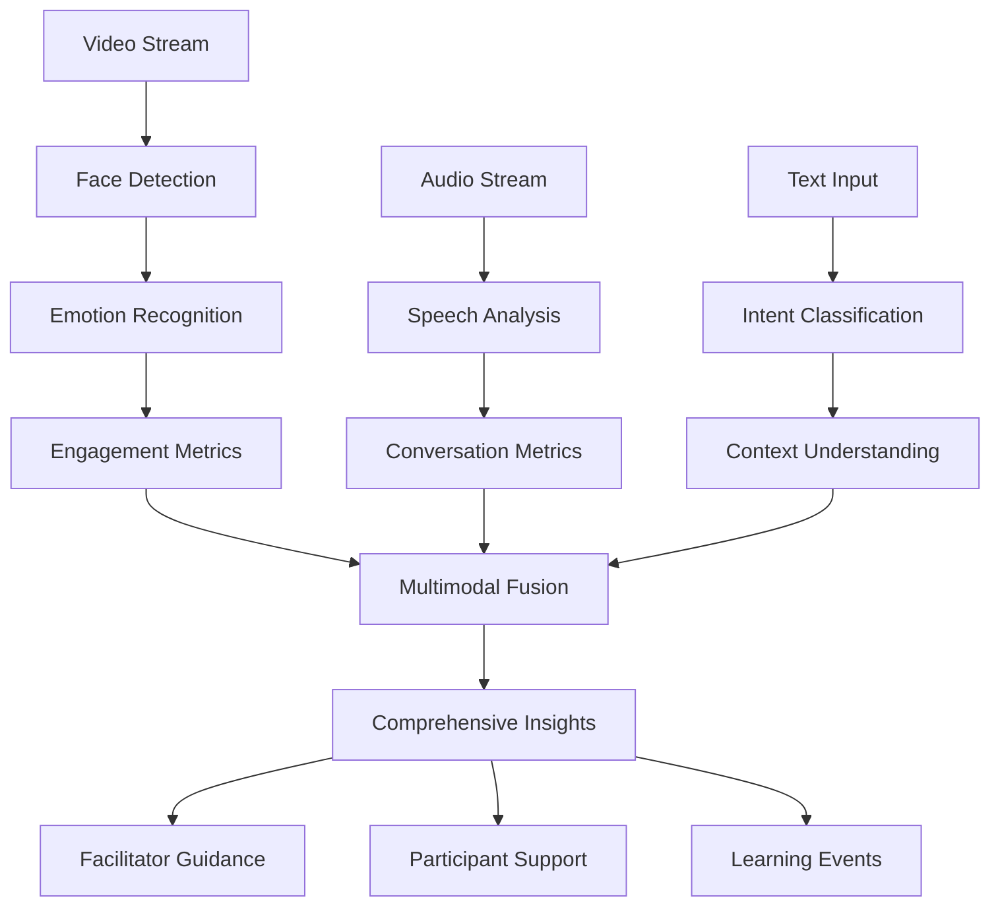

**Key Deliverables:**
- Computer vision pipeline for facial expression analysis
- Multimodal AI integration combining audio, video, and text
- Real-time engagement and attention measurement
- Privacy-preserving video analysis system

### Phase 4: Continuous Learning (Weeks 7-8)
**Learning Pipeline and Model Optimization**

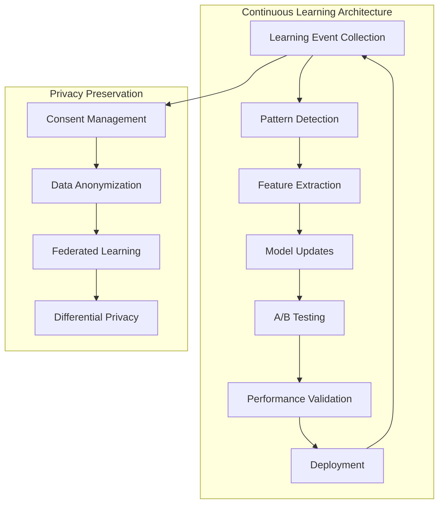

**Key Deliverables:**
- Automated learning pipeline with feedback loops
- Privacy-preserving learning with federated approaches
- Model performance monitoring and drift detection
- Continuous improvement system for all AI components

## Core AI Components You'll Build

### 1. Conversation AI Service

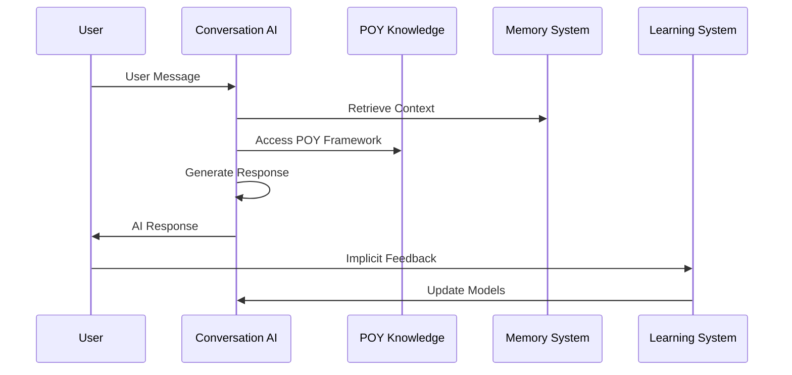

**Your Responsibilities:**
- Implement fine-tuned LLM for POY-specific coaching
- Create context-aware response generation
- Build conversation memory and state management
- Develop empathetic and methodology-aligned responses

### 2. Content Recommendation Engine

```python
class ContentRecommendationEngine:
    """
    Your implementation will include:
    - User behavior analysis and preference modeling
    - Content embedding generation and similarity matching
    - Collaborative and content-based filtering
    - Real-time recommendation updates
    - A/B testing for recommendation algorithms
    """
    
    async def recommend_content(self, user_id: str, context: Dict) -> List[Content]:
        # Your sophisticated recommendation logic here
        pass
    
    async def update_user_preferences(self, user_id: str, feedback: Dict):
        # Continuous learning from user interactions
        pass
```

### 3. Multimodal Analysis System

**Audio Analysis Pipeline:**
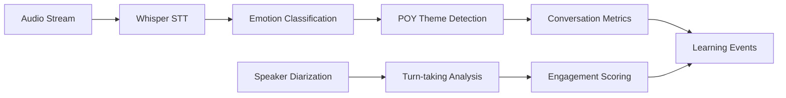

**Video Analysis Pipeline:**
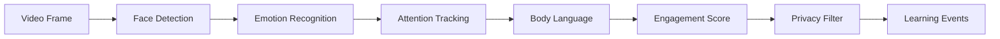

### 4. Continuous Learning System

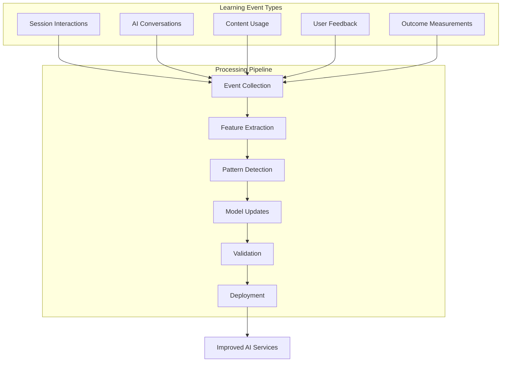

## Technical Implementation Strategy

### Phase 1: Enhanced API Integration (Immediate)
```python
# Your initial implementation approach
class POYConversationAI:
    def __init__(self):
        self.openai_client = OpenAI()
        self.poy_prompts = POYPromptLibrary()
        self.context_manager = ConversationContextManager()
    
    async def generate_response(self, user_input: str, context: Dict) -> str:
        # Sophisticated prompt engineering with POY methodology
        prompt = self.poy_prompts.build_contextual_prompt(user_input, context)
        response = await self.openai_client.chat.completions.create(
            model="gpt-4",
            messages=prompt,
            temperature=0.7
        )
        return self.post_process_response(response, context)
```

### Phase 2: Fine-Tuned Specialization
```python
# Your fine-tuning implementation
class POYFineTunedModel:
    def __init__(self):
        self.base_model = "llama-2-13b-chat"
        self.lora_adapters = LoRAAdapters()
        self.training_pipeline = TrainingPipeline()
    
    async def fine_tune_on_poy_data(self, training_data: List[Dict]):
        # Fine-tune Llama-2 with POY-specific conversations
        model = await self.training_pipeline.fine_tune(
            base_model=self.base_model,
            training_data=training_data,
            method="lora",
            epochs=3
        )
        return model
```

### Phase 3: MCP Implementation
```typescript
// Model Context Protocol for POY Studio
interface POYContextProtocol {
  sessionContext: {
    currentPhase: "Pause" | "Expand" | "Focus" | "Doing";
    participantStates: ParticipantState[];
    selectedCards: Card[];
    conversationHistory: Message[];
  };
  
  userContext: {
    preferences: UserPreferences;
    journeyStage: string;
    goals: Goal[];
    emotionalState: EmotionalState;
  };
  
  contentContext: {
    availableContent: Content[];
    usageRights: ContentLicense[];
    recommendations: Recommendation[];
  };
}
```

## Advanced AI Features You'll Implement

### 1. Zoom Integration with AI Analysis

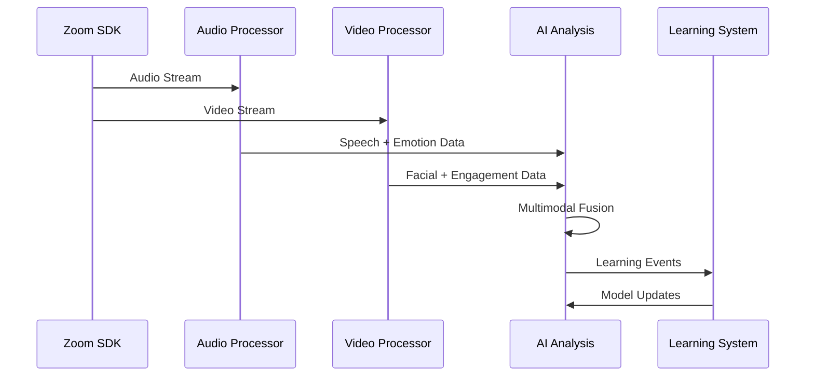

### 2. Privacy-Preserving Learning

```python
class PrivacyPreservingLearning:
    """
    Your implementation of ethical AI learning:
    - Federated learning across organizations
    - Differential privacy for data protection
    - Consent-based data usage
    - Synthetic data generation
    """
    
    async def federated_model_update(self, org_updates: List[Dict]) -> Dict:
        # Aggregate updates without sharing raw data
        pass
    
    async def apply_differential_privacy(self, data: List[LearningEvent]) -> List[LearningEvent]:
        # Add noise while preserving utility
        pass
```

### 3. Outcome Prediction and Optimization

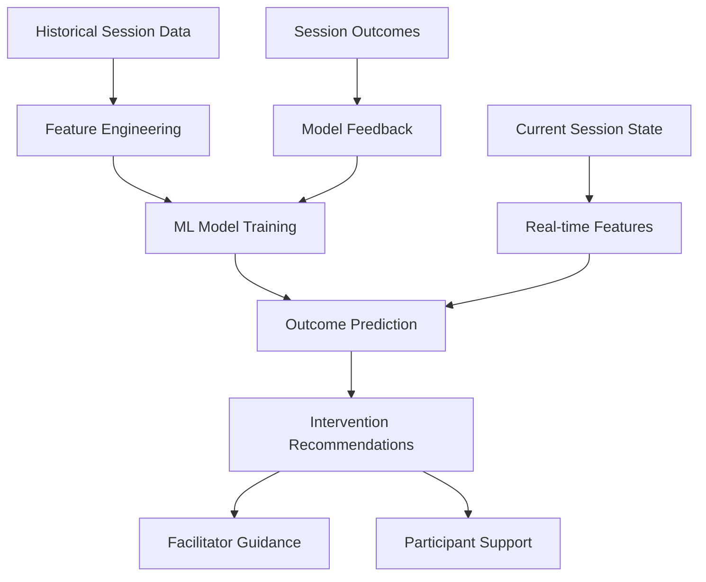

## Integration with Team Development

### Coordination with Django Developer
- **API Contracts**: Define AI service endpoints and data formats
- **Real-time Integration**: WebSocket communication for live AI insights
- **Database Design**: Collaborate on AI-related data models
- **Authentication**: Integrate AI services with user authentication

### Coordination with Frontend Developer
- **AI Interface Design**: Collaborate on AI coach and copilot interfaces
- **Real-time Updates**: Ensure smooth AI response delivery
- **Performance Optimization**: Optimize AI response times for UX
- **Error Handling**: Graceful degradation when AI services are unavailable

## Success Metrics and KPIs

### AI Performance Metrics
- **Response Relevance**: 85%+ relevance rating from users
- **Conversation Quality**: 4.5/5 average rating for AI interactions
- **Personalization Accuracy**: 80%+ accurate content recommendations
- **Learning Speed**: 48-hour pattern detection and model updates

### Business Impact Metrics
- **User Engagement**: 25% increase in session completion rates
- **Facilitator Efficiency**: 30% reduction in preparation time
- **Learning Outcomes**: 40% improvement in participant goal achievement
- **Platform Stickiness**: 35% improvement in user retention rates

## Development Environment and Tools

### Required Technology Stack
```yaml
Core AI Framework:
  - Python 3.9+
  - PyTorch/TensorFlow
  - Transformers (Hugging Face)
  - FastAPI for AI service APIs

ML Operations:
  - MLflow for experiment tracking
  - Weights & Biases for monitoring
  - Docker for containerization
  - Kubernetes for orchestration

Data Processing:
  - Pandas, NumPy for data manipulation
  - Scikit-learn for traditional ML
  - OpenCV for computer vision
  - Librosa for audio processing

Model Serving:
  - vLLM or TensorRT for inference
  - Redis for caching
  - PostgreSQL with pgvector
  - Celery for async processing
```

### Development Workflow
1. **Week 1**: Environment setup and basic conversation AI
2. **Week 2**: POY integration and context management
3. **Week 3**: Content recommendation engine
4. **Week 4**: Audio analysis pipeline
5. **Week 5**: Video processing and computer vision
6. **Week 6**: Multimodal AI integration
7. **Week 7**: Continuous learning system
8. **Week 8**: Performance optimization
9. **Week 9**: Advanced features and enterprise capabilities
10. **Week 10**: Integration testing and validation
11. **Week 11**: Production deployment preparation
12. **Week 12**: Launch support and monitoring

## Getting Started

### Immediate Next Steps
1. **Review Documentation**: Deep dive into POY methodology and system architecture
2. **Set Up Environment**: Configure development environment with required tools
3. **API Design**: Collaborate with Django developer on AI service contracts
4. **Prototype Development**: Build basic conversation AI with OpenAI integration
5. **Team Integration**: Establish communication protocols with frontend developer

### Key Resources
- [Continuous Learning Mechanism](./CONTINUOUS_LEARNING_MECHANISM.md) - Your learning system blueprint
- [Custom LLM MCP Analysis](./CUSTOM_LLM_MCP_ANALYSIS.md) - Advanced AI implementation strategy
- [Zoom Video Audio Event Collection](./ZOOM_VIDEO_AUDIO_EVENT_COLLECTION.md) - Multimodal analysis requirements
- [Developer Timelines](./DEVELOPER_TIMELINES.md) - Your detailed week-by-week schedule

## Vision and Impact

As the AI Developer, you're not just building another chatbot or recommendation system. You're creating an AI companion that:

- **Preserves Human Connection**: Enhances rather than replaces human facilitation
- **Learns Continuously**: Becomes more effective with every interaction
- **Respects Privacy**: Maintains ethical standards in AI development
- **Scales Impact**: Enables quality coaching for global audiences
- **Innovates Methodology**: Pushes the boundaries of digital facilitation

Your work will directly impact thousands of facilitators and hundreds of thousands of participants worldwide, helping them achieve meaningful personal and professional growth through AI-enhanced Points of You experiences.

Welcome to the team! Let's build something extraordinary together.
