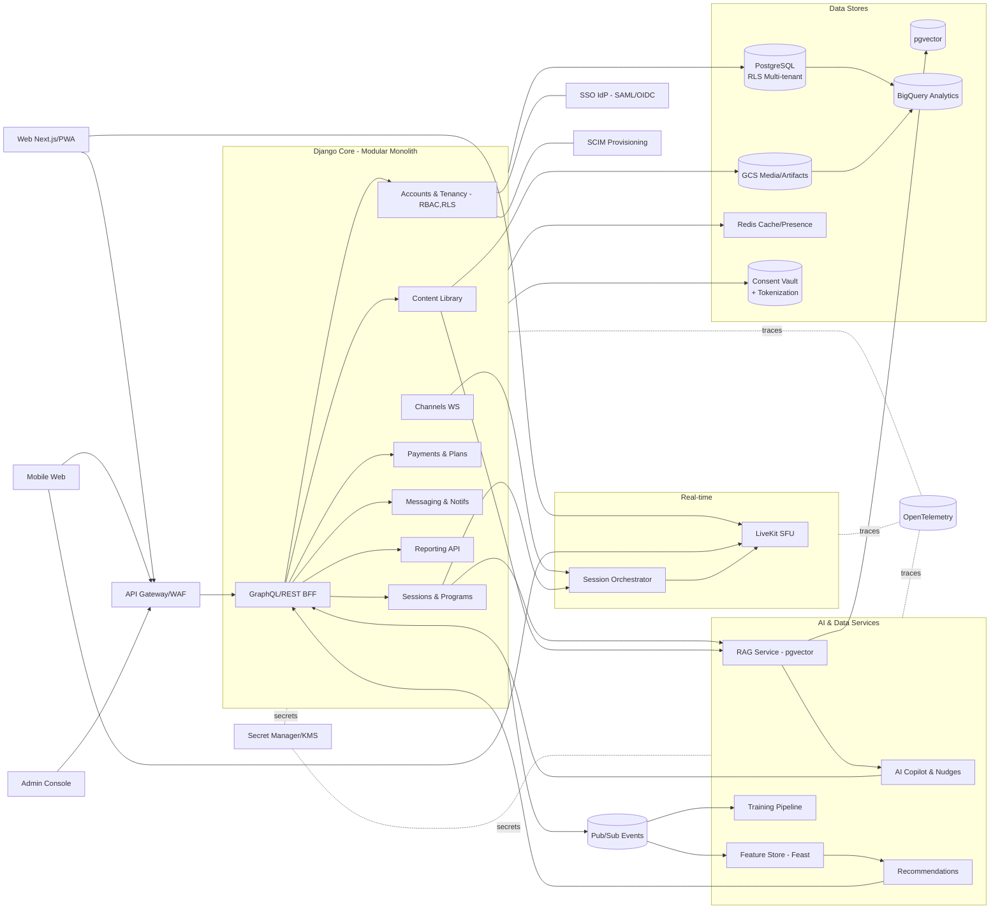

# Architecture Diagram

Owner: Miron Krokhmal

# Recommended blueprint (MVP → Scale)

**Pattern:** Modular Monolith for core + two satellites

- **Core App (Monolith):** Django + DRF/GraphQL for most business logic (users, sessions, content, billing, admin).
- **Satellite 1 (Real-time):** WebRTC SFU (e.g., LiveKit) for rooms/voice/video/low-latency interactions; WebSockets for chat/whiteboard events.
- **Satellite 2 (AI/RecSys Workers):** Async workers (Celery on Cloud Run Jobs / GKE) for summarization, suggestions, analytics, and periodic training.

# Reference stack (by layer)

- **Clients**: Next.js (React) web + PWA; Tailwind; TanStack Query; WebRTC client SDK; Tiptap/tldraw for boards; i18n.
- **BFF/API**: GraphQL (Strawberry/Ariadne) or DRF REST + API Gateway; WebSockets via Django Channels (non-SFU events).
- **Core Domains (Django apps)**:
    - Accounts & Tenancy (RBAC, orgs/teams, SSO SAML/OIDC, SCIM)
    - Sessions/Programs (agendas, activities, outcomes)
    - Content Library (cards, templates, packs, licensing)
    - Payments & Subscriptions (Stripe)
    - Messaging/Notifications (email, push, in-app)
    - Reporting/Analytics (exports, dashboards)
- **Real-time**: LiveKit SFU (rooms, media) + Redis for presence/pubsub; sidecar service for session orchestration.
- **AI & Data**:
    - **RAG** over content library; embeddings in **pgvector**; on-the-fly grounding.
    - AI Copilot (prompting, nudges, summaries, reflection Qs).
    - RecSys: session/context features → candidate templates/cards.
    - Feature Store: Feast (optional, phase 2).
    - Model training: batch pipelines (Vertex AI or self-hosted) on anonymized data.
- **Data Stores**:
    - **PostgreSQL** (Cloud SQL) with **row-level security** for multi-tenancy.
    - **GCS** for media/artifacts; signed URLs.
    - **Redis** for cache, rate-limits, presence.
    - **OpenSearch/Elasticsearch** (optional) for full-text; start with Postgres + pgvector.
    - **BigQuery** (or ClickHouse) for analytics/lakehouse.
- **Events & ETL**: Pub/Sub (domain events, audit, analytics), dbt for transforms, scheduled Celery/Dataflow jobs.
- **Security & Compliance**:
    - Consent Vault (PII consents, purposes, expiries) stored separately; tokenization for analytics.
    - Secrets in Secret Manager; KMS-encrypted buckets; per-tenant data keys (if required).
    - Audit trails (immutable log stream → BigQuery).
- **Observability**: OpenTelemetry (traces/metrics/logs) → Cloud Trace/Logging + Grafana/Prometheus; SLOs per service.
- **CI/CD**: GitHub Actions → Cloud Build → deploy to Cloud Run / GKE; blue/green for core; canary for AI workers.
- **Deployments**:
    - **Default:** Cloud Run (core/BFF/workers), Cloud SQL, GCS, Pub/Sub, LiveKit on GKE.
    - **Sovereign/Air-gapped option:** K8s (Anthos/Tanzu), Postgres, MinIO, NATS/Kafka, OpenSearch; model hosting on-prem.

# Why this works

- **Speed now, separation where it matters:** Core in one codebase reduces overhead; real-time media and AI are isolated (different scaling profiles, incident blast-radius).
- **Clean data boundaries:** Consent vault and tokenization keep analytics/AI safe; pgvector stays inside your control for privacy-sensitive retrieval.
- **Smooth path to enterprise:** SSO/SCIM, audit, RBAC with RLS; event bus for extensibility; switchable storage/runtime for sovereign deployments.
- **Cost-aware scaling:** Cloud Run autoscaling for core/worker; GKE only where truly needed (SFU).

# Phased rollout

1. **MVP (0–8 weeks)**
- Django core (users/tenancy, sessions, content, Stripe, basic reports)
- LiveKit managed instance + simple whiteboard/chat
- AI Copilot v0 (templated nudges + summaries) with pgvector
- Analytics v0: events → Pub/Sub → BigQuery
1. **V1 (8–20 weeks)**
- Admin analytics dashboards, SCIM/SSO, marketplace packs
- Recommendation v1 (content & template ranking)
- Consent vault + tokenization; content RAG hardened
1. **V2 (20+ weeks)**
- Feature store, scheduled training, advanced org reporting
- Sovereign deployment profile (K8s) for anchor customers