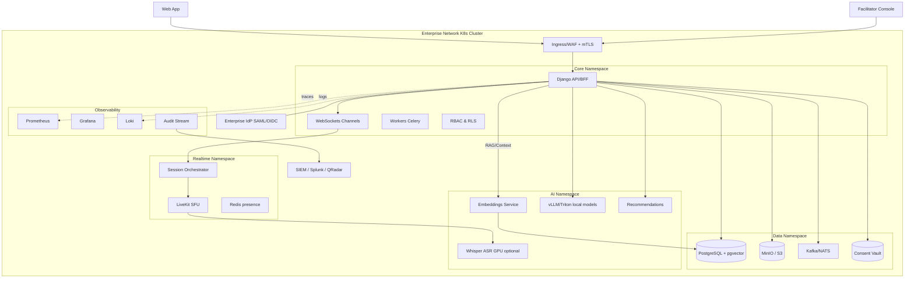

# Deployment Profiles

Owner: Miron Krokhmal

# Deployment profiles (choose per customer)

- **SaaS (default):** Cloud Run + managed services.
- **Private Cloud / Connected On-Prem:** Customer K8s with outbound egress allowed; optional use of their managed DB/IDP.
- **Air-gapped On-Prem:** Fully isolated K8s, private registries, offline updates, self-hosted AI/ASR.

# Component map → on-prem substitutes

| Capability | SaaS default | On-prem (connected) | On-prem (air-gapped) |
| --- | --- | --- | --- |
| Core app/API | Cloud Run (Django) | K8s (Helm/Kustomize) | K8s (Helm, no egress) |
| Realtime SFU | LiveKit Cloud | LiveKit on K8s | LiveKit on K8s |
| DB | Cloud SQL Postgres | Customer Postgres/EDB | Postgres HA (Patroni) |
| Object storage | GCS | S3-compatible (NetApp/Ceph/MinIO) | MinIO |
| Cache/presence | Memorystore (Redis) | Redis on K8s/VM | Redis on K8s/VM |
| Vector store | pgvector | pgvector / OpenSearch+kNN | pgvector |
| Search | Postgres FTS | OpenSearch/Elastic | OpenSearch |
| ASR | Managed STT | Managed STT or Whisper on GPU | Whisper (faster-whisper) |
| LLM/Copilot | Managed API (Vertex/Azure) | Customer’s LLM (Azure OpenAI/Vertex private) or vLLM | vLLM/Triton + local models |
| Events/ETL | Pub/Sub | Kafka/NATS | Kafka/NATS |
| Analytics | BigQuery | ClickHouse/Snowflake (private) | ClickHouse |
| Identity | Hosted OIDC | Enterprise SAML/OIDC + SCIM | Enterprise SAML/OIDC + SCIM |
| Secrets/KMS | GCP Secret/KMS | HashiCorp Vault + HSM/KMS | Vault + HSM/KMS |
| Observability | Cloud Logging/Trace | Prometheus + Grafana + Loki | Same, export to SIEM |
| Consent/Audit | App service + BQ | App service + SIEM/Splunk | App service + SIEM |

## On-prem topology (Mermaid)

# Data governance & crypto

- **Tenant isolation:** Postgres Row-Level Security (RLS) + per-tenant schemas optional for high-sensitivity orgs.
- **Keys:** BYOK/HYOK with Vault/HSM; envelope encryption for PII; object storage SSE-KMS.
- **Consent vault:** separate schema/service with purpose-bound tokens; retention & redaction jobs.

# Identity & access

- **SSO:** SAML/OIDC with just-in-time provisioning or SCIM.
- **Admin boundaries:** org admin, facilitator, participant roles; policy enforcement in API gateway + app layer.
- **Service-to-service:** mTLS (SPIFFE/SPIRE or cert-manager); network policies default-deny.

# Observability & compliance

- **OTel everywhere:** traces/metrics/logs → Prometheus/Grafana/Loki; forward audit logs to SIEM.
- **Policy packs:** CIS Benchmarks for K8s/OS; image signing (Sigstore cosign), SBOMs, vuln scanning (Trivy/Grype).
- **Standards:** ISO 27001/27701 mapping, SOC2 controls pack; DPA addendum for on-prem.

# Packaging & updates

- **Distribution:** Private OCI registry (air-gapped mirror), signed images, Helm charts with SemVer; migration jobs baked in.
- **Upgrades:** Blue/green for API, canary for AI workers; DB migrations gated by preflight checks.
- **Offline mode:** quarterly “update bundles” (charts + images + SBOM + release notes); checksum verification.

# Network & security posture

- Ingress via customer WAF/NGFW; internal east-west isolated with K8s NetworkPolicies.
- mTLS between services; JWTs short-lived; rotate secrets via Vault.
- No hard egress—egress proxy policy file; toggle “strict offline” for air-gapped customers.

# AI/ASR choices on-prem

- **LLM:** pluggable—Azure OpenAI private endpoint, Vertex private, or local (Llama/Command/DeepSeek) via vLLM/Triton.
- **ASR:** managed (if egress) or local Whisper (faster-whisper) with diarization (pyannote).
- **Safety:** rule-based filters + small local classifiers; do not ship any user data outside cluster.

# Indicative sizing (start point)

- **Core/API:** 2–4 vCPU, 4–8 GB RAM (HPA to ~8 pods).
- **SFU:** 1 pod per ~150–250 active participants; scale by media bitrate.
- **LLM (local):** 1× A10/A100 or L4 per ~10–30 rps (depends on model/quantization).
- **ASR:** CPU for light load; GPU preferred for sub-second latency at scale.

# Migration: SaaS → on-prem (per tenant)

1. Freeze tenant writes; export DB schema subset + objects to encrypted bundle.
2. Rehydrate into on-prem Postgres/MinIO; rotate secrets/keys.
3. Re-provision identity (SSO/SCIM), webhooks, SMTP.
4. Run verification suite (checksums, referential integrity, synthetic sessions).
5. Switch DNS; monitor with heightened SLOs for 72 h.