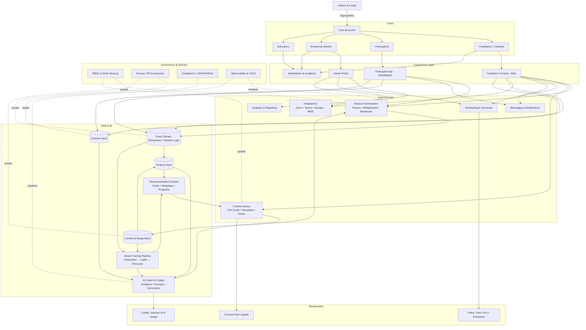

# High-level architecture / data flow

Owner: Miron Krokhmal

```mermaid
graph TD
  %% POI.AI — Product Concept (High-Level)
  A[Visitors & Leads] -->|Signup/SSO| B[User Accounts]

  subgraph Users
    B --> C1[Facilitators / Coaches]
    B --> C2[Participants]
    B --> C3[Enterprise Admins]
    B --> C4[Educators]
  end

  subgraph Experience Layer
    E1[Facilitator Console - Web]
    E2[Participant App - Web/Mobile]
    E3[Admin Portal]
    E4[Marketplace & Academy]
  end

  C1 --> E1
  C2 --> E2
  C3 --> E3
  C1 --> E4
  C3 --> E4
  C4 --> E4

  subgraph Core Services
    S1[Session Orchestrator<br/>Rooms • Whiteboards • Breakouts]
    S2[Content Library<br/>POI Cards • Templates • Decks]
    S3[Scheduling & Payments]
    S4[Messaging & Notifications]
    S5[Analytics & Reporting]
    S6[Integrations<br/>Zoom • Teams • Google • HRIS]
  end

  E1 --> S1
  E2 --> S1
  E1 --> S2
  E3 --> S5
  E1 --> S3
  E3 --> S3
  E1 --> S4
  E2 --> S4
  E1 --> S6
  E3 --> S6

  subgraph Data & AI
    D1[(Event Stream<br/>Clickstream • Session Logs)]
    D2[(Content & Media Store)]
    D3[(Consent Vault)]
    D4[(Feature Store)]
    D5[AI Coach & Copilot<br/>Guidance • Prompts • Summaries]
    D6[Recommendation Engine<br/>Cards • Templates • Programs]
    D7[Model Training Pipeline<br/>Anonymize → Label → Fine-tune]
  end

  S1 --> D1
  S2 --> D2
  E1 --> D1
  E2 --> D1
  E1 --> D3
  E2 --> D3
  D1 --> D4
  D2 --> D4
  D4 --> D5
  D4 --> D6
  D3 --> D5
  D5 --> S1
  D6 --> S2
  D7 --> D5
  D7 --> D6
  D1 --> D7
  D2 --> D7

  subgraph Governance & DevOps
    G1[RBAC & Multi-Tenancy]
    G2[Privacy / PII Anonymizer]
    G3[Compliance / GDPR/HIPAA]
    G4[Observability & CI/CD]
  end

  G1 -. guards .- S1
  G1 -. guards .- S2
  G2 -. scrubs .- D1
  G2 -. scrubs .- D2
  G3 -. audits .- D3
  G4 -. monitors .- S1
  G4 -. monitors .- D5

  subgraph Monetization
    M1[Plans: Free • Pro • Enterprise]
    M2[Credits: Session & AI Usage]
    M3[Content Pack Upsells]
  end

  S3 --> M1
  D5 --> M2
  S2 --> M3

```