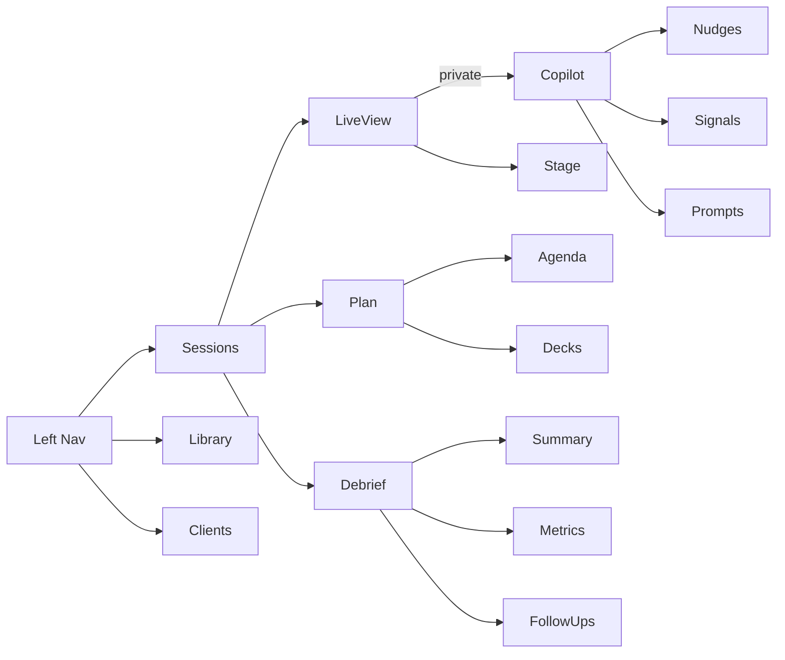
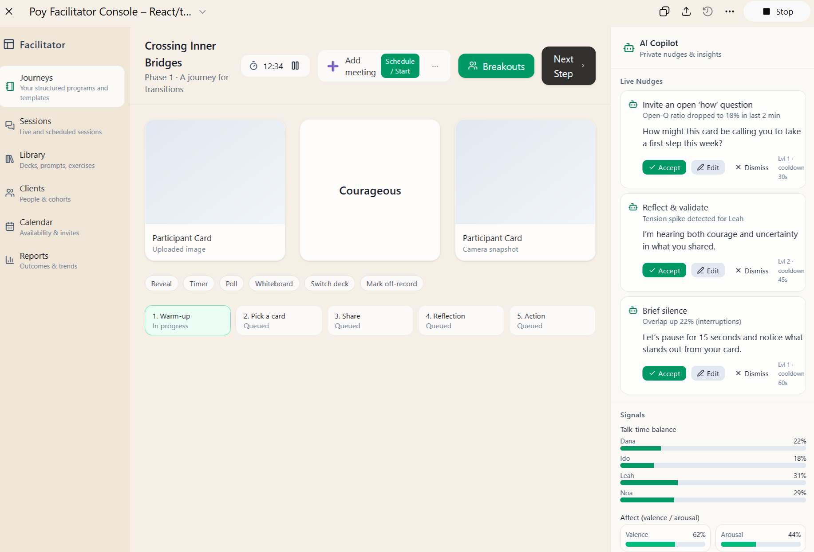

# Key  Facilitator Screens

Owner: Miron Krokhmal

# Layout (one screen, three rails)

- **Left rail (Navigation)**
    - **Journeys** • **Sessions** • **Library** • **Clients** • **Calendar** • **Reports**
- **Center stage (What participants see)**
    - Current **cards** / media • agenda step • shared notes/whiteboard • chat
    - **Presenter tools**: reveal/hide, timers, breakouts, poll, “switch deck”
- **Right rail (AI Copilot & Signals)** — *private to facilitator*
    1. **Live Nudges** (Accept · Edit · Dismiss)
    2. **Participants** (list with consent state, mic/cam, hand raise)
    3. **Affect & Balance** (valence/arousal bars, talk-time donut, open-question ratio, interruption flags)
    4. **Prompt Library** (search tags: acknowledge, reframe, scale, future-step)
    5. **Risk & Safety** (distress/jailbreak flags, escalation playbook)

---

# Key screens

## 1) Pre-session (Plan)

- **Agenda builder** (drag steps): Warm-up → Card pick → Share → Reflection → Action
- **Deck & template picker** with preview and “AI suggest flow from goals”
- **Participant prep**: roster import, consent toggles, accessibility prefs
- **Co-facilitator mode**: roles & handoff points
- **Readiness checks**: content loaded, timer, backup plan

## 2) In-session (Guide)

- **Stage header**: title, phase, timer, “next step” button
- **AI nudge queue** (always visible):
    - “Try an open *how* question” · “Reflect: *I’m hearing…*” · “Invite silence (20s)”
    - Tooltip shows **why** (e.g., *open-Q ratio dropped to 18%*)
- **Signals widget**:
    - **Talk-time balance** per participant
    - **Affect trend** (last 3 minutes)
    - **Tension spikes** & **overlap** (interruptions)
- **Breakouts**:
    - Smart pairing (similar/different cards), room timers, broadcast prompts
- **Content quick-swap**:
    - Replace card / add second card / flip to word card
- **Consent-aware transcript**:
    - Toggle STT; redaction on by default; mark “off-record” moments
- **Action capture**:
    - One-click “turn reflection → action” with owner + due date

## 3) Post-session (Reflect & Share)

- **Auto-summary** with citations to transcript snippets
- **Outcome pack**: chosen cards, key quotes, insights, actions
- **Quality metrics**:
    - Open-question ratio, reflection count, participant talk-time balance, engagement curve
- **Coach review**:
    - Rate AI nudges (train the copilot), add notes to library
- **Follow-ups**:
    - Schedule 15-min check-in, send personal reflection, assign micro-exercise

---

# Information architecture (quick map)

# Component details (ready for Figma/React)

- **Nudge Card**: title, rationale, difficulty (1–3), *Accept/Edit/Dismiss*, cooldown badge
- **Signals Panel**:
    - *Affect*: dual bar (valence/arousal) + “confidence” dots
    - *Open-Q ratio*: live % + trend arrow
    - *Talk-time*: donut with per-speaker chips (mute/coach button)
- **Prompt Library Search**: chips (acknowledge / reframe / scale / future / values / strengths), tone (gentle/neutral/energizing), length (short/long)
- **Breakout Orchestrator**: pairing rule (similar/different cards), room size, countdown, broadcast prompt, “bring back now”
- **Safety Drawer**: distress detected → show script, escalation contacts, one-click “pause & ground” prompt

---

# Micro-copy (examples)

- *“I’m hearing courage and uncertainty—would you like a reflection or an open question?”*
- *“Pause for 15 seconds; invite one word from each person.”*
- *“Scale from 1–10: where are you now, and what makes it a point higher than before?”*

---

# Accessibility & privacy

- Live captions, large-text mode, high-contrast theme
- Consent banner (who sees what), PII redaction status, “off-record” toggle

---

If you want, I can turn this into a clickable low-fi mockup (Tailwind/React) or a Figma component spec with tokens (colors, spacings, type scale) that match your current POY style.

