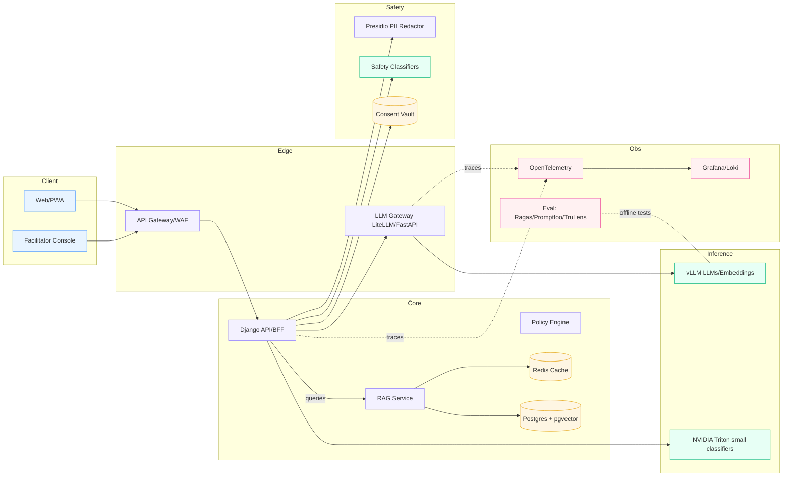

# LLM infrastructure and Tools

Owner: Miron Krokhmal

1) Serving layer (pick 1 primary + 1 fallback)

| Need | SaaS/Connected | Fully on-prem | Why |
| --- | --- | --- | --- |
| **General LLM inference** | **Vertex AI / Azure OpenAI** | **vLLM** (open-source) on K8s | Managed when you can; vLLM for fast, cheap, local serving (paged attention, continuous batching, KV-cache). |
| **Small tasks (clas./routing)** | Vertex text-bison/gemini or OpenAI small | **Triton Inference Server** hosting small classifiers | Cheap/fast heads for emotion/acts/open-Q flags; keeps latency <~200ms. |
| **Embedding** | Vertex, OpenAI, Cohere | **bge-m3 / e5-mistral** on vLLM/Triton | Multilingual, royalty-free, strong recall. |

**Notes:**

- Standardize on the **OpenAI-compatible API** surface (vLLM supports it) so your app code doesn’t care where it runs.
- Keep **model weights** in a private OCI registry / MinIO bucket with license metadata.

# 2) Orchestration & gateway (your control plane)

- **LLM Gateway (microservice):** request auth, rate limits, **routing** (by task/tenant/cost/latency), **fallbacks**, **A/B**, and **token accounting**.
    - Tools: **LiteLLM** (proxy to 100+ providers incl. vLLM), or a thin FastAPI gateway you own.
- **Function/Tool calling:** JSON-Schema tools with strict allow-lists; sandbox any external calls.
- **Structured output:** Pydantic JSON modes (with retries/grammar constraints).

# 3) Retrieval & memory

- **Vector DB:** **Postgres + pgvector** (default). For very large recall or strict SLAs: **Qdrant** or **OpenSearch k-NN** on-prem.
- **Indexing pipeline:** semantic chunking + metadata (roles, consent, deck, activity); **pre-redact PII** before indexing.
- **RAG patterns:**
    - *Reflective prompts:* short-context RAG with session goal + last 6–10 turns.
    - *Playbook lookup:* exact-match + hybrid (BM25 + vector) over your prompt library; return citations.

# 4) Safety, privacy, and policy

- **PII/PHI redaction:** **Microsoft Presidio** (on-prem) + custom lexicons.
- **Prompt-injection & jailbreak checks:** guardrail layer (regex + small classifier) before LLM, plus deny-list of tools.
- **Content policies:** lightweight toxicity/violence/self-harm classifiers (on Triton) to gate outputs.
- **Consent vault:** separate schema/service; pass only allowed fields to LLM; log purpose & retention.

# 5) Observability & evaluation

- **Tracing:** OpenTelemetry in the gateway and app; log **latency, tokens, cache-hit rate, route**.
- **LLM run logging & dashboards:** Helicone (self-host) or custom OTEL → Grafana/Loki.
- **Eval & regression:** **promptfoo / Ragas / TruLens / Giskard** for offline tests (exact-match, faithfulness, toxicity).
- **Canary releases:** route ~5–10% of traffic to a new model/prompt; auto-rollback on SLO breach.

# 6) Cost & latency controls (critical for live nudges)

- **KV-cache everywhere** (vLLM) + **prompt caching** (semantic cache in Redis/pgvector).
- **Speculative decoding** (if model supports) and **response streaming** to the UI.
- **Model routing:** small model for classification/rewrites; bigger model only for “hard” generations (long reflection).
- **Quantization:** AWQ/GPTQ or FP8 on NVIDIA for on-prem; keep one “quality” model unquantized for eval.

# 7) CI/CD & packaging

- **Images:** containerize vLLM/Triton/TGI with **cosign-signed** OCI images; store in private registry.
- **Charts:** Helm with 3 values profiles: `saas`, `connected-onprem`, `airgapped`.
- **Data & weights:** DVC or Git-LFS for prompts/prompts-RAG, MinIO for models; SBOMs + vulnerability scans (Trivy).
- **Red-team suite:** prompts for jailbreak/PII exfiltration, run in CI on every model/prompt change.

# 8) Minimal reference architecture (Mermaid)

# 9) Concrete tool picks (safe defaults)

- **Serving:** vLLM (LLM), Triton (small heads), optional TGI; GPUs: L4 (cost-eff), A10/A100 (high throughput).
- **Embeddings:** `bge-m3` (local) + provider fallback.
- **Orchestration:** LiteLLM proxy, or custom FastAPI; Redis for semantic & KV caches.
- **Vector DB:** Postgres + pgvector (default), Qdrant/OpenSearch if you outgrow Postgres.
- **Safety:** Presidio + tiny toxicity/self-harm classifiers; rule-based PI guard.
- **Eval:** promptfoo for regressions, Ragas for RAG, TruLens or Phoenix (Arize) for qualitative review.
- **Observability:** OTEL → Grafana/Loki; per-tenant dashboards (latency, cost, acceptance rate).

# 10) Sizing hints (order-of-magnitude)

- **Live coach prompts (<800ms):** small/medium instruct model with KV-cache and short context (≤1–2k tokens).
- **Throughput:** one L4 can serve multiple RPS for short prompts with vLLM continuous batching; scale horizontally behind the gateway.
- **Memory:** keep 1–2 replicas per model; autoscale by queue depth + latency SLO.

---