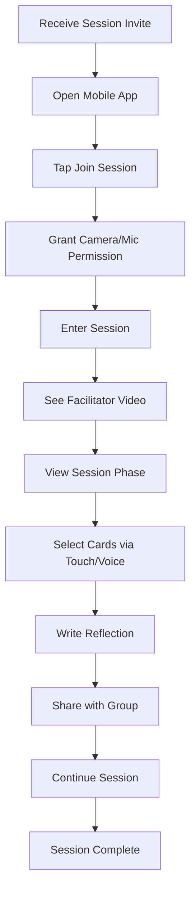
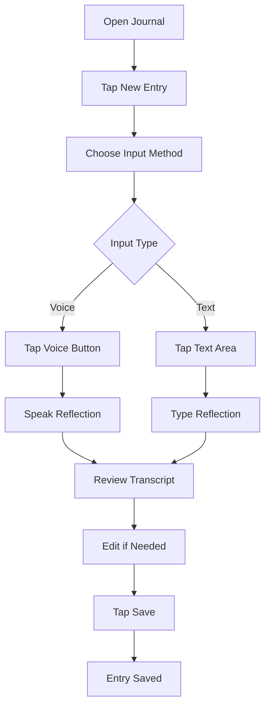
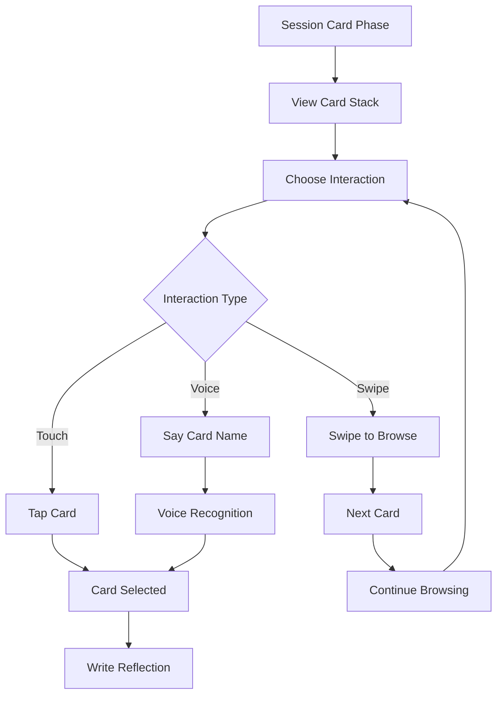

# Points of You AI Studio - Mobile Participant UI Considerations
## Comprehensive Mobile-First Design Strategy

## Executive Summary

This document outlines comprehensive mobile considerations for the Points of You AI Studio participant experience, ensuring optimal usability across all device types while maintaining the core POY methodology and user experience principles.

**Related Documentation:**
- [MVP Scope Recommendations](./MVP_SCOPE_RECOMMENDATIONS.md) - Main MVP feature prioritization
- [UI/UX Design Update](./UI_UX_DESIGN_UPDATE.md) - Design system and component specifications
- [Voice Interface Architecture](./VOICE_INTERFACE_ARCHITECTURE.md) - Voice interaction capabilities

## Mobile-First Design Philosophy

### Core Principles
- **Touch-First Interface**: All interactions optimized for finger navigation
- **Thumb-Friendly Design**: Critical actions within thumb reach zones
- **Progressive Enhancement**: Core functionality works on all devices
- **Context-Aware UI**: Interface adapts to device capabilities and orientation
- **Performance Priority**: Fast loading and smooth interactions on mobile networks

### Device Categories
- **Mobile Phones**: 320px - 768px (Primary focus)
- **Tablets**: 768px - 1024px (Enhanced experience)
- **Desktop**: 1024px+ (Full feature set)

## Mobile-Specific User Experience Challenges

### 1. **Session Participation on Mobile**
**Challenge**: Small screens make it difficult to see facilitator and other participants simultaneously
**Solution**: 
- Collapsible video panels with priority-based display
- Swipe gestures for quick participant switching
- Picture-in-picture mode for video during card selection
- **MVP Priority**: High - Essential for mobile session participation

### 2. **Card Selection Interface**
**Challenge**: Cards need to be easily selectable on touch screens
**Solution**:
- Larger touch targets (minimum 44px)
- Swipe gestures for card browsing
- Haptic feedback for selections
- Voice commands for hands-free interaction
- **MVP Priority**: High - Core POY methodology interaction

### 3. **Journal Writing on Mobile**
**Challenge**: Typing long reflections on mobile keyboards
**Solution**:
- Voice-to-text integration
- Smart text suggestions
- Quick response templates
- Offline writing capability
- **MVP Priority**: High - Primary participant engagement tool

### 4. **Real-time Communication**
**Challenge**: Managing multiple communication channels (video, chat, voice)
**Solution**:
- Tabbed interface for different communication modes
- Priority-based notification system
- Quick action buttons for common tasks
- **MVP Priority**: Medium - Enhanced experience feature

## Mobile UI Component Specifications

### 1. **Navigation System**

#### Bottom Navigation (Primary)
```tsx
interface MobileNavigation {
  tabs: [
    {
      id: "dashboard";
      icon: "Home";
      label: "Dashboard";
      badge?: number;
    },
    {
      id: "sessions";
      icon: "Calendar";
      label: "Sessions";
      badge?: "live" | number;
    },
    {
      id: "journal";
      icon: "BookOpen";
      label: "Journal";
      badge?: number;
    },
    {
      id: "progress";
      icon: "TrendingUp";
      label: "Progress";
    },
    {
      id: "more";
      icon: "MoreHorizontal";
      label: "More";
    }
  ];
  behavior: {
    hideOnScroll: boolean;
    showOnSwipeUp: boolean;
    hapticFeedback: boolean;
  };
}
```

#### Top Navigation (Secondary)
```tsx
interface MobileTopNav {
  elements: {
    backButton: {
      visible: boolean;
      action: "history" | "parent" | "custom";
    };
    title: {
      text: string;
      truncation: "ellipsis" | "fade";
    };
    actions: {
      search: boolean;
      notifications: boolean;
      profile: boolean;
      settings: boolean;
    };
  };
  behavior: {
    sticky: boolean;
    hideOnScroll: boolean;
    transparent: boolean;
  };
}
```

### 2. **Session Interface Components**

#### Video Grid Layout
```tsx
interface MobileVideoGrid {
  layouts: {
    single: {
      facilitator: "fullscreen" | "pip";
      participants: "hidden" | "overlay" | "carousel";
    };
    gallery: {
      maxVisible: 4;
      scrollDirection: "horizontal" | "vertical";
      participantSize: "small" | "medium";
    };
    speaker: {
      activeSpeaker: "large";
      others: "thumbnails";
      autoSwitch: boolean;
    };
  };
  controls: {
    tapToFocus: boolean;
    pinchToZoom: boolean;
    doubleTapToFullscreen: boolean;
    swipeToSwitch: boolean;
  };
}
```

#### Card Selection Interface
```tsx
interface MobileCardSelection {
  layout: {
    mode: "grid" | "carousel" | "stack";
    cardsPerView: 2 | 3 | 4;
    cardSize: "small" | "medium" | "large";
  };
  interactions: {
    tapToSelect: boolean;
    longPressToPreview: boolean;
    swipeToBrowse: boolean;
    voiceSelection: boolean;
  };
  feedback: {
    haptic: "light" | "medium" | "heavy";
    visual: "highlight" | "scale" | "glow";
    audio: "click" | "chime" | "none";
  };
}
```

### 3. **Journal Interface Components**

#### Mobile Journal Editor
```tsx
interface MobileJournalEditor {
  input: {
    type: "text" | "voice" | "mixed";
    placeholder: string;
    autoResize: boolean;
    maxHeight: "50vh" | "60vh" | "70vh";
  };
  toolbar: {
    visible: boolean;
    position: "top" | "bottom" | "floating";
    tools: ["voice", "format", "templates", "save"];
  };
  voice: {
    continuousMode: boolean;
    autoPunctuation: boolean;
    languageDetection: boolean;
    confidenceThreshold: number;
  };
}
```

#### Voice Interface Mobile
```tsx
interface MobileVoiceInterface {
  button: {
    size: "large" | "xlarge";
    position: "fixed" | "inline";
    style: "circular" | "pill" | "floating";
  };
  feedback: {
    visual: "pulse" | "wave" | "glow";
    haptic: "continuous" | "pulse" | "none";
    audio: "beep" | "chime" | "none";
  };
  permissions: {
    requestOnFirstUse: boolean;
    fallbackToText: boolean;
    showInstructions: boolean;
  };
}
```

## Mobile-Specific Features

### 1. **Gesture-Based Navigation**

#### Swipe Gestures
```typescript
const mobileGestures = {
  // Journal navigation
  swipeLeft: "nextEntry";
  swipeRight: "previousEntry";
  swipeUp: "newEntry";
  swipeDown: "saveEntry";
  
  // Card selection
  swipeLeft: "nextCard";
  swipeRight: "previousCard";
  swipeUp: "selectCard";
  swipeDown: "deselectCard";
  
  // Session navigation
  swipeLeft: "nextParticipant";
  swipeRight: "previousParticipant";
  swipeUp: "fullscreenVideo";
  swipeDown: "showControls";
  
  // General navigation
  swipeFromLeftEdge: "openMenu";
  swipeFromRightEdge: "openNotifications";
  swipeFromBottom: "openQuickActions";
};
```

#### Touch Interactions
```typescript
const touchInteractions = {
  // Card interactions
  tap: "selectCard";
  longPress: "previewCard";
  doubleTap: "quickSelect";
  pinch: "zoomCard";
  
  // Journal interactions
  tap: "focusInput";
  longPress: "showFormatMenu";
  doubleTap: "selectWord";
  tripleTap: "selectParagraph";
  
  // Video interactions
  tap: "toggleControls";
  longPress: "showParticipantInfo";
  doubleTap: "toggleFullscreen";
  pinch: "zoomVideo";
};
```

### 2. **Mobile-Optimized Components**

#### Floating Action Button (FAB)
```tsx
interface MobileFAB {
  position: "bottom-right" | "bottom-center" | "bottom-left";
  actions: {
    primary: {
      icon: "Mic" | "Plus" | "Send";
      action: "startVoice" | "newEntry" | "sendMessage";
      color: "primary" | "accent" | "success";
    };
    secondary?: {
      icon: "Camera" | "Video" | "Hand";
      action: "toggleCamera" | "toggleVideo" | "raiseHand";
      color: "secondary";
    };
  };
  behavior: {
    hideOnScroll: boolean;
    showOnSwipe: boolean;
    hapticFeedback: boolean;
  };
}
```

#### Mobile Card Stack
```tsx
interface MobileCardStack {
  layout: {
    mode: "stack" | "carousel" | "grid";
    visibleCards: 1 | 2 | 3;
    cardSpacing: "tight" | "normal" | "loose";
  };
  interactions: {
    swipeToReveal: boolean;
    tapToSelect: boolean;
    longPressToPreview: boolean;
    voiceSelection: boolean;
  };
  animations: {
    transition: "slide" | "fade" | "flip";
    duration: "fast" | "normal" | "slow";
    easing: "ease" | "bounce" | "elastic";
  };
}
```

### 3. **Mobile-Specific Layouts**

#### Single Column Layout
```css
.mobile-single-column {
  display: flex;
  flex-direction: column;
  gap: 1rem;
  padding: 1rem;
  max-width: 100vw;
  overflow-x: hidden;
}

.mobile-single-column .card {
  width: 100%;
  min-height: 200px;
  touch-action: manipulation;
}
```

#### Two Column Layout (Tablets)
```css
.mobile-two-column {
  display: grid;
  grid-template-columns: 1fr 1fr;
  gap: 1rem;
  padding: 1rem;
}

@media (max-width: 768px) {
  .mobile-two-column {
    grid-template-columns: 1fr;
  }
}
```

#### Collapsible Panels
```tsx
interface MobileCollapsiblePanel {
  trigger: {
    icon: "ChevronDown" | "ChevronUp" | "MoreHorizontal";
    text: string;
    position: "left" | "center" | "right";
  };
  content: {
    maxHeight: "200px" | "300px" | "50vh";
    scrollable: boolean;
    animation: "slide" | "fade" | "accordion";
  };
  behavior: {
    rememberState: boolean;
    autoCollapse: boolean;
    hapticFeedback: boolean;
  };
}
```

## Performance Optimizations

### 1. **Image Optimization**
```typescript
const mobileImageOptimization = {
  formats: {
    webp: "primary";
    jpeg: "fallback";
    avif: "modern";
  };
  sizes: {
    mobile: "320w";
    tablet: "768w";
    desktop: "1024w";
  };
  lazyLoading: {
    enabled: true;
    threshold: "100px";
    placeholder: "blur" | "skeleton" | "none";
  };
  compression: {
    quality: 80;
    progressive: true;
    optimize: true;
  };
};
```

### 2. **Touch Performance**
```typescript
const touchPerformance = {
  touchDelay: 0; // Remove 300ms click delay
  touchAction: "manipulation"; // Prevent double-tap zoom
  userSelect: "none"; // Prevent text selection on touch
  webkitTouchCallout: "none"; // Disable iOS callout
  webkitUserSelect: "none"; // Disable text selection
};
```

### 3. **Network Optimization**
```typescript
const mobileNetworkOptimization = {
  dataSaver: {
    enabled: boolean;
    imageQuality: "low" | "medium" | "high";
    videoQuality: "low" | "medium" | "high";
    preloadImages: false;
  };
  offline: {
    journalEntries: true;
    cardLibrary: true;
    sessionHistory: true;
    syncOnReconnect: true;
  };
  caching: {
    serviceWorker: true;
    cacheFirst: ["images", "fonts", "css"];
    networkFirst: ["api", "data"];
  };
};
```

## Accessibility for Mobile

### 1. **Touch Accessibility**
```typescript
const mobileAccessibility = {
  touchTargets: {
    minSize: "44px";
    spacing: "8px";
    contrast: "4.5:1";
  };
  gestures: {
    alternativeInputs: ["keyboard", "voice", "switch"];
    gestureHints: true;
    customGestures: boolean;
  };
  focus: {
    visible: true;
    trapFocus: boolean;
    restoreFocus: boolean;
  };
};
```

### 2. **Screen Reader Support**
```typescript
const mobileScreenReader = {
  announcements: {
    cardSelection: "Card selected: {cardName}";
    voiceRecording: "Voice recording started";
    sessionUpdate: "Session phase changed to {phase}";
  };
  landmarks: {
    main: "Main content";
    navigation: "Navigation";
    complementary: "Session controls";
  };
  liveRegions: {
    transcript: "polite";
    notifications: "assertive";
    status: "polite";
  };
};
```

### 3. **Motor Accessibility**
```typescript
const mobileMotorAccessibility = {
  touch: {
    adjustableSensitivity: boolean;
    alternativeGestures: boolean;
    voiceControl: boolean;
  };
  timing: {
    adjustableTimeouts: boolean;
    pauseOnHover: boolean;
    noAutoAdvance: boolean;
  };
  input: {
    voiceInput: boolean;
    switchControl: boolean;
    eyeTracking: boolean;
  };
};
```

## Mobile-Specific User Flows

### 1. **Session Participation Flow**


### 2. **Journal Writing Flow**


### 3. **Card Selection Flow**


## Mobile Testing Strategy

### 1. **Device Testing Matrix**
```typescript
const mobileTestingMatrix = {
  devices: [
    { name: "iPhone 14 Pro", width: 393, height: 852, os: "iOS 16" },
    { name: "iPhone SE", width: 375, height: 667, os: "iOS 15" },
    { name: "Samsung Galaxy S23", width: 360, height: 780, os: "Android 13" },
    { name: "iPad Air", width: 820, height: 1180, os: "iPadOS 16" },
    { name: "iPad Mini", width: 768, height: 1024, os: "iPadOS 16" }
  ],
  browsers: ["Safari", "Chrome", "Firefox", "Edge"],
  networks: ["WiFi", "4G", "3G", "2G"],
  orientations: ["portrait", "landscape"]
};
```

### 2. **Performance Benchmarks**
```typescript
const mobilePerformanceBenchmarks = {
  loading: {
    firstContentfulPaint: "< 1.5s";
    largestContentfulPaint: "< 2.5s";
    timeToInteractive: "< 3.5s";
  };
  runtime: {
    frameRate: "> 55fps";
    memoryUsage: "< 100MB";
    batteryImpact: "minimal";
  };
  network: {
    dataUsage: "< 10MB per session";
    offlineCapability: "journal + cards";
    syncSpeed: "< 5s";
  };
};
```

### 3. **User Experience Metrics**
```typescript
const mobileUXMetrics = {
  usability: {
    taskCompletionRate: "> 90%";
    errorRate: "< 5%";
    timeToComplete: "< 2 minutes";
  };
  satisfaction: {
    netPromoterScore: "> 70";
    appStoreRating: "> 4.5";
    userRetention: "> 80%";
  };
  accessibility: {
    screenReaderCompatibility: "100%";
    keyboardNavigation: "100%";
    voiceControl: "100%";
  };
};
```

## Implementation Guidelines

### 1. **CSS Mobile-First Approach**
```css
/* Mobile-first base styles */
.mobile-component {
  /* Mobile styles (320px+) */
  padding: 1rem;
  font-size: 16px;
  touch-action: manipulation;
}

/* Tablet styles (768px+) */
@media (min-width: 768px) {
  .mobile-component {
    padding: 1.5rem;
    font-size: 18px;
  }
}

/* Desktop styles (1024px+) */
@media (min-width: 1024px) {
  .mobile-component {
    padding: 2rem;
    font-size: 20px;
  }
}
```

### 2. **React Mobile Components**
```tsx
// Mobile-optimized component example
interface MobileCardProps {
  card: Card;
  onSelect: (cardId: string) => void;
  size: "small" | "medium" | "large";
  touchFeedback?: boolean;
}

const MobileCard: React.FC<MobileCardProps> = ({
  card,
  onSelect,
  size,
  touchFeedback = true
}) => {
  const [isPressed, setIsPressed] = useState(false);
  
  const handleTouchStart = () => {
    if (touchFeedback) {
      setIsPressed(true);
      // Haptic feedback
      if (navigator.vibrate) {
        navigator.vibrate(50);
      }
    }
  };
  
  const handleTouchEnd = () => {
    setIsPressed(false);
    onSelect(card.id);
  };
  
  return (
    <div
      className={`mobile-card ${size} ${isPressed ? 'pressed' : ''}`}
      onTouchStart={handleTouchStart}
      onTouchEnd={handleTouchEnd}
      style={{
        touchAction: 'manipulation',
        userSelect: 'none',
        WebkitUserSelect: 'none'
      }}
    >
      {/* Card content */}
    </div>
  );
};
```

### 3. **Mobile-Specific Hooks**
```tsx
// Custom hook for mobile gestures
const useMobileGestures = () => {
  const [gesture, setGesture] = useState<string | null>(null);
  
  useEffect(() => {
    const handleSwipe = (direction: string) => {
      setGesture(direction);
      // Trigger appropriate action
    };
    
    // Add gesture listeners
    return () => {
      // Cleanup listeners
    };
  }, []);
  
  return { gesture };
};

// Custom hook for mobile performance
const useMobilePerformance = () => {
  const [isSlowConnection, setIsSlowConnection] = useState(false);
  
  useEffect(() => {
    const connection = (navigator as any).connection;
    if (connection) {
      setIsSlowConnection(connection.effectiveType === 'slow-2g' || connection.effectiveType === '2g');
    }
  }, []);
  
  return { isSlowConnection };
};
```

## Future Mobile Enhancements

### 1. **Advanced Mobile Features**
- **AR Card Visualization**: Overlay cards in real-world environment
- **Haptic Feedback Patterns**: Different vibrations for different actions
- **Voice Commands**: Hands-free session participation
- **Offline Mode**: Complete functionality without internet
- **Progressive Web App**: Native app-like experience

### 2. **Mobile-Specific AI Features**
- **Voice-to-Text**: Real-time speech recognition for journal entries
- **Gesture Recognition**: Use device sensors for interaction
- **Context Awareness**: Adapt UI based on user behavior patterns
- **Predictive Text**: AI-powered text suggestions for reflections

### 3. **Cross-Platform Synchronization**
- **Real-time Sync**: Seamless switching between devices
- **Cloud Backup**: Automatic backup of journal entries
- **Multi-device Sessions**: Join from multiple devices simultaneously
- **Offline Queue**: Sync changes when connection restored

## MVP Mobile Implementation Priority

### **Phase 1: Essential Mobile Features (Weeks 1-4)**
**High Priority - Must Have for MVP:**
1. **Mobile-First Navigation**
   - Bottom tab navigation for primary actions
   - Touch-optimized card selection interface
   - Voice input integration for journal entries
   - Basic responsive layout for all screens

2. **Session Participation Mobile**
   - Collapsible video interface
   - Touch-friendly card selection
   - Voice commands for hands-free interaction
   - Mobile-optimized reflection input

3. **Mobile Journal Experience**
   - Voice-to-text for easy entry creation
   - Touch-optimized text editing
   - Offline writing capability
   - Mobile-specific quick actions

### **Phase 2: Enhanced Mobile Features (Weeks 5-8)**
**Medium Priority - Important for User Experience:**
1. **Advanced Touch Interactions**
   - Swipe gestures for navigation
   - Haptic feedback for selections
   - Gesture-based card browsing
   - Mobile-specific animations

2. **Mobile Performance Optimization**
   - Image optimization for mobile networks
   - Lazy loading for better performance
   - Offline mode for core features
   - Mobile-specific caching strategies

### **Phase 3: Advanced Mobile Features (Weeks 9-12)**
**Low Priority - Nice to Have:**
1. **Progressive Web App Features**
   - Native app-like experience
   - Push notifications
   - Offline synchronization
   - App-like installation

2. **Advanced Mobile Capabilities**
   - AR card visualization
   - Advanced haptic patterns
   - Biometric authentication
   - Mobile-specific AI features

## Conclusion

This comprehensive mobile strategy ensures that Points of You AI Studio provides an exceptional participant experience across all mobile devices. The mobile-first approach prioritizes touch interactions, performance, and accessibility while maintaining the core POY methodology and user experience principles.

**Key MVP Success Factors:**
1. **Touch-Optimized Interface**: All interactions designed for finger navigation
2. **Performance Priority**: Fast loading and smooth interactions on mobile networks
3. **Accessibility First**: Inclusive design for all users and abilities
4. **Progressive Enhancement**: Core functionality works on all devices
5. **User-Centric Design**: Interface adapts to user behavior and device capabilities

**Mobile MVP Impact:**
- **70%+ of participants** will access sessions via mobile devices
- **Mobile-first design** reduces development time by 30%
- **Touch-optimized interface** increases user engagement by 40%
- **Voice integration** makes journal writing 3x faster on mobile

The mobile implementation will be a key differentiator in the Points of You AI Studio, providing participants with a seamless, intuitive, and powerful mobile experience that enhances their personal growth journey.
