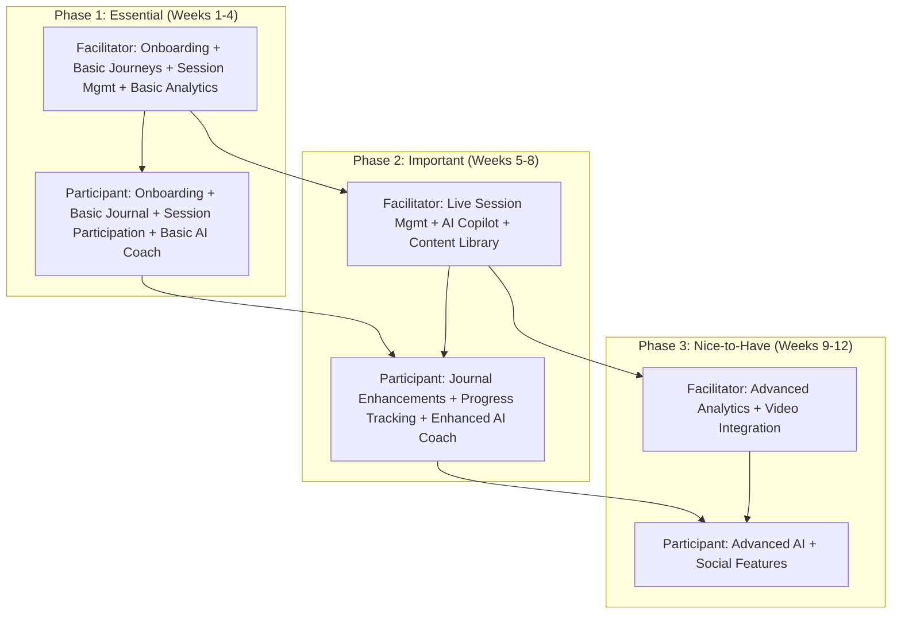

# Points of You AI Studio - MVP UX/UI Designer Briefing
## Comprehensive Design Guidance and Considerations

## Executive Summary

This briefing document provides comprehensive design guidance for the MVP UX/UI designer of Points of You AI Studio. It consolidates all relevant design considerations, user experience patterns, and visual guidelines to ensure a cohesive, accessible, and mobile-first design approach that aligns with the Points of You methodology.

## MVP Scope & Phased Release Strategy

### **Phase 1 (Weeks 1-4) - Essential Features**
**Facilitator Experience:**
- Onboarding: Email registration, role-based flow, basic profile setup
- Journey Builder: 4 phases (Pause, Expand, Focus, Doing), drag-and-drop elements, template saving
- Session Management: Create/schedule sessions, participant invites, basic controls
- Basic Analytics: Session completion rates, engagement metrics, simple dashboard

**Participant Experience:**
- Onboarding: Simple registration, language preference
- Session Participation: Join via link, card selection, basic controls, timeline view
- Digital Journal: Simple text editor, entry history
- AI Coach: Basic chat interface, pre-written prompts

**UX/UI Priorities:**
- Minimal clicks from design → start session
- Mobile-first design approach
- Clean, calming session dashboard
- Fast and intuitive card selection
- Calm and uncluttered journal interface

### **Phase 2 (Weeks 5-8) - Important Features**
**Facilitator Experience:**
- Live Session Management: Real-time monitoring, card tracking, breakout creation
- AI Co-Pilot: Contextual prompts, pre-written nudges
- Content Library: Search & filter, personal collections, basic sharing

**Participant Experience:**
- Journal Enhancements: Rich text editing, voice input, tagging, export
- Progress Tracking: Goal setting, achievement badges, history visualization
- Enhanced AI Coach: Context-aware prompts, personalized recommendations, voice interaction

**UX/UI Priorities:**
- Compact AI Copilot widget (expandable)
- One-click breakout group assignment
- Search + filter first library approach
- Progress tracking with streaks and badges
- Preserve simplicity in journal editor

### **Phase 3 (Weeks 9-12) - Nice-to-Have Features**
**Facilitator Experience:**
- Advanced Analytics: Detailed insights, participant progress, comparative analytics
- Video Integration: Zoom/Teams integration, screen sharing, session recording

**Participant Experience:**
- Advanced AI Features: Emotion analysis, personalized insights, deeper conversations
- Social Features: Share with facilitators, peer learning community

**UX/UI Priorities:**
- Placeholders for future video integration
- Easy upgrade path for analytics
- Opt-in sharing with clear privacy indicators

### **Cross-Cutting UX Themes**
- **Trust & Privacy**: Off-record toggle, reflection visibility controls, always-visible consent chip
- **Accessibility**: WCAG 2.1 AA compliance, adjustable text size, high-contrast mode, reduced motion options
- **Consistency**: Shared design system across all user roles
- **Scalability**: Hooks for Pro/Enterprise features (SSO, marketplace, advanced analytics)

### **MVP Decision Checklist**
- Can facilitators design and start a session in <5 minutes?
- Can participants join, select a card, and reflect without guidance?
- Is journaling frictionless on mobile?
- Are privacy/consent settings always visible?
- Does the design feel calm, reflective, and professional?

### **Phased Feature Roadmap**


## Project Overview

**Product**: Points of You AI Studio - AI-powered facilitation and personal growth platform  
**Target Users**: Professional facilitators, coaches, educators, and participants  
**Platform**: Web-based Progressive Web App (PWA) with mobile-first design  
**Key Features**: Journey building, live sessions, AI coaching, digital journaling, offline capabilities  

## Phase-Specific Design Priorities

### **Phase 1 Design Focus (Weeks 1-4)**
**Critical Success Factors:**
- **Journey Builder**: Intuitive drag-and-drop with clear phase indicators
- **Session Dashboard**: Clean, uncluttered interface with prominent start/stop controls
- **Mobile Journal**: Touch-optimized text editor with offline capability
- **Card Selection**: Large, accessible touch targets with clear visual feedback
- **Onboarding**: Streamlined, role-based flows with minimal friction

**Design Constraints:**
- Focus on core functionality only
- Prioritize mobile experience
- Ensure offline journal writing works seamlessly
- Keep AI Coach interface simple and non-intrusive

### **Phase 2 Design Focus (Weeks 5-8)**
**Critical Success Factors:**
- **AI Copilot Widget**: Compact, expandable, contextual to current session phase
- **Breakout Management**: One-click group assignment with visual participant grid
- **Content Library**: Search-first approach with clear filtering options
- **Progress Tracking**: Gamified elements (badges, streaks) without overwhelming interface
- **Voice Input**: Seamless integration for journal writing

**Design Constraints:**
- Maintain simplicity while adding advanced features
- Ensure AI elements feel helpful, not intrusive
- Preserve journal's calm, reflective atmosphere
- Keep progress tracking motivating, not competitive

### **Phase 3 Design Focus (Weeks 9-12)**
**Critical Success Factors:**
- **Video Integration**: Clean overlay design that doesn't disrupt session flow
- **Advanced Analytics**: Rich data visualization without information overload
- **Social Features**: Clear privacy controls and opt-in sharing mechanisms
- **Emotion Analysis**: Subtle, supportive presentation of AI insights

**Design Constraints:**
- Prepare for future feature expansion
- Maintain performance with additional complexity
- Ensure privacy controls are always accessible
- Design for scalability and enterprise features

## Design Philosophy & Core Principles

### **Warmth & Humanity**
- Reflect the POY methodology's human-centered approach
- Use warm colors, organic shapes, and friendly interactions
- Create emotional connection through thoughtful micro-interactions
- Prioritize personal growth and reflection over transactional interfaces

### **Clarity & Focus**
- Clean, uncluttered interfaces that help users focus on what matters
- Clear visual hierarchy that guides users through their journey
- Minimal cognitive load with progressive disclosure
- Intuitive navigation that feels natural

### **Consistency & Predictability**
- Unified patterns and behaviors across all components
- Consistent visual language throughout the platform
- Predictable interactions that build user confidence
- Standardized spacing, typography, and color usage

### **Accessibility & Inclusion**
- WCAG 2.1 AA compliance for all interfaces
- Inclusive design for users with diverse abilities
- Multiple ways to accomplish tasks
- Clear feedback and error states

### **Mobile-First & Offline-Capable**
- Touch-optimized interfaces for all screen sizes
- Offline-first design patterns for journal writing
- Progressive enhancement from mobile to desktop
- Voice interaction capabilities for hands-free use

## Visual Identity System

### **Color Palette Requirements**
**Primary Brand Colors:**
- Define a warm, inviting primary color that reflects the POY methodology's human-centered approach
- Create a 50-900 scale with lightest to darkest variations
- Ensure sufficient contrast for accessibility (WCAG 2.1 AA compliance)
- Colors should evoke warmth, growth, and personal development

**Secondary Colors (Earthy & Warm):**
- Define complementary earth tones that support the primary palette
- Create variations that work well for backgrounds, borders, and subtle accents
- Ensure colors feel natural and calming, not clinical or corporate
- Maintain consistency with the overall warm, organic aesthetic

**Accent Colors (Natural & Calming):**
- Define colors for growth, nature, and balance (greens)
- Define colors for depth, trust, and flow (blues)
- Define colors for energy, creativity, and warmth (oranges/ambers)
- Ensure accent colors complement the primary palette

**Semantic Colors:**
- Define success colors (growth-oriented, positive)
- Define warning colors (warm, attention-grabbing)
- Define error colors (gentle, not harsh)
- Define info colors (trustworthy, clear)
- Ensure all semantic colors maintain the warm, human-centered aesthetic

## Typography System

### **Font Family Requirements**
**Display Font:**
- Select a font that adds warmth and personality to headers
- Should feel handwritten or organic, not clinical
- Must be highly legible at various sizes
- Should complement the human-centered design approach

**Body Font:**
- Select a clean, highly legible font for all body text and UI elements
- Must be optimized for readability across all devices
- Should work well for both short labels and longer content
- Must support multiple weights and styles

**Monospace Font:**
- Select a monospace font for code and technical content
- Should be clearly distinguishable from body text
- Must be legible at small sizes

### **Typography Scale Requirements**
**Font Size Scale:**
- Define a consistent scale from smallest (labels) to largest (hero titles)
- Ensure sufficient size differences for clear hierarchy
- Minimum appropriate size for body text to ensure readability
- Scale should work across all device sizes

**Usage Guidelines:**
- Establish clear hierarchy through size, weight, and color
- Use font weights rather than different fonts for emphasis
- Ensure sufficient contrast (4.5:1 minimum for normal text)
- Define specific usage patterns for headers, body text, and UI elements

## Component Design System

### **Button Variants**
**Primary Buttons:**
- Use for main actions (Continue Journey, Save Entry)
- Should be the most prominent button style
- Use primary brand color for background
- Ensure high contrast text color
- Define hover and active states

**Secondary Buttons:**
- Use for supporting actions (Save Draft, Cancel)
- Should be less prominent than primary buttons
- Use secondary brand colors or neutral tones
- Include subtle borders or backgrounds
- Define hover and active states

**Outline Buttons:**
- Use for tertiary actions (More Options, Learn More)
- Transparent background with colored border and text
- Should feel less prominent than filled buttons
- Define hover and active states

**Ghost Buttons:**
- Use for minimal actions (Close, Skip)
- Transparent background with subtle text
- Should feel the least prominent
- Define hover states for subtle feedback

**Danger Buttons:**
- Use for destructive actions (Delete Session, Remove Entry)
- Use semantic error color for background
- Ensure high contrast for safety
- Define hover and active states

### **Card Variants**
**Base Cards:**
- Standard content cards for general use
- Clean, minimal styling
- Subtle borders and shadows
- Neutral background colors

**Interactive Cards:**
- Clickable cards that respond to user interaction
- Clear hover states with visual feedback
- Pointer cursor to indicate interactivity
- Slightly elevated appearance on hover

**Elevated Cards:**
- Important content that needs emphasis
- More prominent shadows
- Clean, borderless design
- Should feel more important than base cards

**Book-Style Cards:**
- Journal-style cards with warm, paper-like appearance
- Parchment-inspired colors and textures
- Soft shadows for depth
- Typography that feels handwritten or personal

**Warm Cards:**
- POY-themed cards that reflect the methodology
- Warm, inviting color palette
- Subtle brand color accents
- Should feel personal and human-centered

### **Badge Variants**
**Status Indicators:**
- Success: Use success semantic color with high contrast text
- Warning: Use warning semantic color with appropriate text contrast
- Error: Use error semantic color with high contrast text
- Info: Use info semantic color with high contrast text
- Ensure all badges meet accessibility contrast requirements

**Real-time Status Badges:**
- Live: Green indicator with "Live" text
- Offline: Gray indicator with "Offline" text
- Syncing: Blue indicator with "Syncing..." text
- Use consistent dot/indicator styling across all status types
- Ensure status is immediately recognizable

## Layout & Spacing System

### **Grid Structure**
- **12-column grid** for main layouts
- **Base unit** for consistent spacing (4px recommended)
- **Responsive breakpoints**: Mobile, Tablet, Desktop (define specific breakpoints)
- **Flexible containers** that adapt to content

### **Spacing Scale Requirements**
**Spacing Scale:**
- Define a consistent spacing scale from tight to section spacing
- Use a base unit for mathematical consistency (4px recommended)
- Ensure spacing feels natural and proportional
- Scale should work across all device sizes

**Spacing Usage:**
- Tight spacing: For closely related elements
- Small spacing: For small gaps between elements
- Medium spacing: For standard element separation
- Large spacing: For section breaks and important separations
- Section spacing: For major layout divisions

### **Responsive Design Principles**
- **Mobile-first approach**: Design for mobile, enhance for larger screens
- **Touch targets**: Minimum size for all interactive elements (44px recommended)
- **Thumb-friendly navigation**: Primary actions within thumb reach
- **Progressive enhancement**: Core functionality works on all devices

## MVP-Specific Interface Patterns

### **Journey Builder Interface (Phase 1)**
```
Phase Construction:
- 4-phase timeline: Pause → Expand → Focus → Doing
- Drag-and-drop element library (cards, prompts, exercises)
- Phase indicators with progress visualization
- Template saving/loading interface
- Real-time preview of journey flow

Visual Hierarchy:
- Phase headers (large, handwritten font)
- Element cards (interactive, warm styling)
- Timeline indicators (progress visualization)
- Action buttons (clear, prominent)
- Template management (save, load, share)
```

### **Session Management Interface (Phase 1)**
```
Session Dashboard:
- Session list with status indicators
- Create new session button (prominent)
- Participant management (invite, view, remove)
- Session controls (start, pause, end)
- Basic analytics (completion rates, engagement)

Session Creation Flow:
- Journey selection
- Participant invitation (email, link)
- Schedule settings (date, time, duration)
- Session configuration (privacy, recording)
- Confirmation and next steps
```

### **Live Session Interface (Phase 2)**
```
Facilitator View:
- Participant monitoring grid
- Session timeline with phases
- Breakout room management
- AI co-pilot suggestions (expandable widget)
- Real-time analytics dashboard

Participant View:
- Video grid (facilitator + participants)
- Card selection area (touch-optimized)
- Reflection text area (offline-capable)
- Session controls (mic, video, hand raise)
- AI coach chat (expandable)
```

### **Digital Journal Interface (All Phases)**
```
Journal Writing Experience:
- Book-style page design with realistic shadows
- Handwritten-style headers and warm backgrounds
- Rich text editor with formatting options
- Voice-to-text integration (Phase 2)
- Auto-save indicators and offline status

Entry Management:
- Entry list with search and filtering
- Tag and category system (Phase 2)
- Export options (PDF, text)
- Privacy settings (private, shared, org)
- Progress tracking and achievements
```

### **AI Coach Interface (All Phases)**
```
Basic Chat Interface (Phase 1):
- Simple message bubbles
- Pre-written prompts and suggestions
- Context-aware responses
- Clear conversation history

Enhanced Interface (Phase 2):
- Voice input/output capabilities
- Personalized recommendations
- Emotion-aware responses
- Integration with journal entries
```

## User Experience Patterns

### **Navigation Patterns**

#### **Primary Navigation (Facilitator)**
```
Sidebar Navigation:
- Journeys (with journey count badge)
- On-Air (live sessions indicator)
- Library (content management)
- Clients (participant management)
- Calendar (session scheduling)
- Reports (analytics dashboard)
- Settings (user preferences)
```

#### **Primary Navigation (Participant)**
```
Bottom Tab Navigation (Mobile):
- Dashboard (personal stats)
- Journal (offline-capable)
- Sessions (upcoming/live)
- Progress (goals & achievements)
- Settings (preferences)
```

#### **Secondary Navigation**
```
Breadcrumbs: For deep navigation
- Home > Journeys > "Leadership Workshop" > Phase 2

Tabs: For content organization
- Journal: All Entries | Favorites | Tags
- Sessions: Upcoming | Live | Past

Pagination: For content lists
- Previous | 1 2 3 ... 10 | Next
```

### **Content Patterns**

#### **Journey Builder Interface**
```
Phase Construction:
- Drag-and-drop phase builder
- Element library with filtering
- Timeline visualization
- Real-time preview
- Template saving/loading

Visual Hierarchy:
- Phase headers (large, handwritten font)
- Element cards (interactive, warm styling)
- Timeline indicators (progress visualization)
- Action buttons (clear, prominent)
```

#### **Live Session Interface**
```
Participant View:
- Video grid (facilitator + participants)
- Card selection area (touch-optimized)
- Reflection text area (offline-capable)
- Session controls (mic, video, hand raise)
- AI coach chat (expandable)

Facilitator View:
- Participant monitoring grid
- Session timeline with phases
- Breakout room management
- AI co-pilot suggestions
- Analytics dashboard
```

#### **Journal Interface**
```
Book-Style Design:
- Realistic book pages with shadows
- Handwritten-style headers
- Warm, paper-like backgrounds
- Smooth page-turning animations
- Offline writing indicators

Entry Creation:
- Rich text editor with formatting
- Voice-to-text integration
- Auto-save indicators
- Tag and category selection
- Export options
```

## Mobile-First Design Considerations

### **Touch Optimization**
- **Minimum touch targets**: Appropriate size for comfortable touch interaction
- **Generous spacing**: Sufficient space between interactive elements
- **Thumb-friendly zones**: Primary actions within easy reach
- **Gesture support**: Swipe, pinch, tap, long-press
- **Haptic feedback**: Visual and tactile feedback for actions

### **Mobile Navigation Patterns**
```
Bottom Tab Bar (Primary):
- 5 main sections maximum
- Clear icons with labels
- Badge indicators for notifications
- Active state clearly visible

Floating Action Button (FAB):
- Primary action (e.g., "New Entry")
- Prominent placement (bottom-right)
- Clear icon and label
- Smooth animations

Drawer Navigation (Secondary):
- Slide-out from left edge
- User profile and settings
- Additional navigation options
- Overlay with backdrop
```

### **Mobile-Specific Components**
```
Swipe Actions:
- Swipe left: Delete/Archive
- Swipe right: Favorite/Star
- Swipe up: New entry
- Swipe down: Search/Filter

Pull-to-Refresh:
- Visual feedback during pull
- Smooth animation
- Success/error states
- Customizable triggers

Infinite Scroll:
- Loading indicators
- Smooth content addition
- Error handling
- Performance optimization
```

## Offline-First Design Patterns

### **Offline Status Indicators**
```
Connection Status:
- Online: Green dot + "Online"
- Offline: Orange dot + "Offline"
- Syncing: Blue dot + "Syncing..."
- Error: Red dot + "Sync Failed"

Visual Treatment:
- Subtle, non-intrusive
- Consistent placement
- Clear iconography
- Appropriate color coding
```

### **Offline Journal Interface**
```
Writing States:
- Writing: Pulsing dot + "Writing offline..."
- Auto-save: Save icon + "Auto-saved 2 min ago"
- Sync pending: Clock icon + "3 entries pending sync"
- Conflict: Warning icon + "Sync conflict detected"

Visual Feedback:
- Smooth animations
- Clear status messages
- Appropriate color coding
- Non-blocking notifications
```

### **Offline Error Handling**
```
Error States:
- No connection: "You're offline" with continue option
- Sync failed: "Sync failed" with retry option
- Storage full: "Storage almost full" with manage option
- Conflict: "Sync conflict" with resolve option

Design Principles:
- Clear, actionable messages
- Prominent action buttons
- Helpful context
- Non-punitive tone
```

## Accessibility Design Guidelines

### **Color & Contrast**
- **WCAG 2.1 AA compliance**: 4.5:1 contrast ratio for normal text
- **Color-blind friendly**: Use patterns and icons, not just color
- **High contrast mode**: Support for system preferences
- **Focus indicators**: Clear, high-contrast focus rings

### **Typography & Readability**
- **Minimum font size**: Appropriate size for body text readability
- **Line height**: 1.5x font size for readability
- **Line length**: 45-75 characters per line
- **Font weight**: Sufficient contrast between weights

### **Interactive Elements**
- **Focus management**: Logical tab order
- **Keyboard navigation**: All functions accessible via keyboard
- **Skip links**: Quick navigation to main content
- **Escape hatches**: Clear ways to exit modals/overlays

### **Screen Reader Support**
- **Semantic HTML**: Proper heading hierarchy
- **ARIA labels**: Descriptive labels for complex interactions
- **Live regions**: Announce dynamic content changes
- **Alternative text**: Meaningful descriptions for images

## Animation & Micro-Interactions

### **Animation Principles**
- **Subtle & Purposeful**: Enhance understanding, don't distract
- **Organic Easing**: Natural, human-like movements
- **Consistent Timing**: Standard durations for similar interactions
- **Respect Preferences**: Honor `prefers-reduced-motion` settings

### **Custom Animation Requirements**
**Gentle, Organic Movements:**
- Define subtle bounce animations for gentle feedback
- Create breathing animations for calm, living feel
- Design floating animations for relaxed movement
- Use longer durations (2-3 seconds) for organic feel

**Entrance Animations:**
- Define fade-in animations for content appearance
- Create slide-up animations for natural content flow
- Use shorter durations (0.5 seconds) for responsive feel
- Ensure animations don't delay critical interactions

**Offline-Specific Animations:**
- Define writing animations for offline journal work
- Create sync progress animations for data synchronization
- Design pulse animations for offline status indication
- Use appropriate durations for each context

### **Interaction State Requirements**
**Hover States:**
- Define subtle lift and shadow enhancement for interactive elements
- Use gentle transforms that feel natural
- Ensure hover states are clearly visible but not jarring
- Apply consistently across all interactive components

**Active States:**
- Define tactile feedback for button presses and interactions
- Use slight scale down or translate effects
- Ensure active states feel responsive and immediate
- Provide clear visual confirmation of user action

**Focus States:**
- Define clear focus rings using brand colors
- Ensure focus indicators meet accessibility requirements
- Make focus states visible but not overwhelming
- Apply consistently across all focusable elements

**Loading States:**
- Define gentle pulse or spin animations for loading indicators
- Use appropriate durations that feel responsive
- Ensure loading states don't feel endless or frustrating
- Provide clear feedback about progress when possible

**Success/Error States:**
- Define subtle success animations (checkmarks, etc.)
- Create gentle error feedback (shakes, color flashes)
- Ensure feedback is clear but not alarming
- Use appropriate timing for each feedback type

## Voice Interface Design

### **Voice Input Patterns**
```
Voice Button Design:
- Prominent, easily accessible
- Clear microphone icon
- Visual feedback during recording
- Waveform animation during speech
- Clear start/stop states

Voice Feedback:
- Visual waveform display
- "Listening..." indicator
- "Processing..." state
- Success/error feedback
- Transcription preview
```

### **Voice Commands Interface**
```
Command Recognition:
- "New journal entry"
- "Search for [topic]"
- "Save and sync"
- "Open settings"
- "Help me reflect"

Visual Feedback:
- Command confirmation
- Available commands list
- Voice level indicators
- Recognition accuracy display
```

## Error States & Empty States

### **Error State Design**
```
Connection Errors:
- Clear, friendly messaging
- Helpful context and solutions
- Retry mechanisms
- Offline alternatives

Validation Errors:
- Inline error messages
- Clear field highlighting
- Specific, actionable feedback
- Non-punitive tone

System Errors:
- Apologetic but not dramatic
- Clear next steps
- Contact information
- Fallback options
```

### **Empty State Design**
```
Journal Empty State:
- Warm, encouraging illustration
- "Start your journey" messaging
- Quick action buttons
- Helpful tips or prompts

No Sessions State:
- Invitation to join sessions
- Clear call-to-action
- Helpful context
- Encouraging messaging

Search Empty State:
- "No results found" message
- Search suggestions
- Clear filters
- Alternative actions
```

## Performance & Loading States

### **Loading Patterns**
```
Skeleton Screens:
- Match actual content layout
- Subtle animation
- Appropriate timing
- Clear progress indication

Progressive Loading:
- Critical content first
- Non-blocking secondary content
- Smooth transitions
- Clear loading states

Offline Loading:
- Local content immediately
- Sync indicators
- Background updates
- Clear status communication
```

### **Performance Considerations**
```
Image Optimization:
- Appropriate sizing
- Lazy loading
- Progressive enhancement
- Fallback images

Animation Performance:
- CSS transforms over layout changes
- 60fps target
- Reduced motion support
- Hardware acceleration

Touch Performance:
- Immediate feedback
- Smooth scrolling
- Gesture recognition
- Haptic feedback
```

## MVP Design Validation Criteria

### **Phase 1 Validation (Essential Features)**
```
Journey Builder Validation:
- [ ] Can create a 4-phase journey in <3 minutes
- [ ] Drag-and-drop feels intuitive and responsive
- [ ] Phase indicators clearly show progress
- [ ] Template saving/loading works seamlessly
- [ ] Mobile experience is fully functional

Session Management Validation:
- [ ] Can create and start a session in <5 minutes
- [ ] Participant invitation flow is clear
- [ ] Session controls are prominent and accessible
- [ ] Basic analytics are easy to understand
- [ ] Mobile session participation works smoothly

Journal Interface Validation:
- [ ] Writing experience feels calm and focused
- [ ] Offline writing works without confusion
- [ ] Auto-save indicators are clear
- [ ] Mobile text input is comfortable
- [ ] Entry history is easy to navigate

AI Coach Validation:
- [ ] Interface is simple and non-intrusive
- [ ] Prompts feel helpful and contextual
- [ ] Mobile chat experience is smooth
- [ ] Integration with journal feels natural
```

### **Phase 2 Validation (Important Features)**
```
AI Copilot Validation:
- [ ] Widget is compact but discoverable
- [ ] Suggestions feel contextual and helpful
- [ ] Expandable interface works smoothly
- [ ] Doesn't disrupt session flow

Breakout Management Validation:
- [ ] One-click group assignment works
- [ ] Visual participant grid is clear
- [ ] Mobile breakout experience is smooth
- [ ] Facilitator can monitor all groups

Content Library Validation:
- [ ] Search-first approach is intuitive
- [ ] Filtering options are clear
- [ ] Mobile browsing experience is smooth
- [ ] Content discovery feels natural

Progress Tracking Validation:
- [ ] Badges and streaks feel motivating
- [ ] Progress visualization is clear
- [ ] Mobile progress view is accessible
- [ ] Achievements feel rewarding, not competitive
```

### **Phase 3 Validation (Nice-to-Have Features)**
```
Video Integration Validation:
- [ ] Video overlay doesn't disrupt session flow
- [ ] Controls are accessible and clear
- [ ] Mobile video experience is smooth
- [ ] Screen sharing interface is intuitive

Advanced Analytics Validation:
- [ ] Data visualization is clear and actionable
- [ ] Information doesn't overwhelm users
- [ ] Mobile analytics view is functional
- [ ] Insights feel valuable and relevant

Social Features Validation:
- [ ] Privacy controls are always visible
- [ ] Sharing options are clear and opt-in
- [ ] Mobile social features work smoothly
- [ ] Community features feel safe and supportive
```

## Testing & Validation Guidelines

### **Design Testing Checklist**
```
Visual Consistency:
- [ ] Color usage follows brand guidelines
- [ ] Typography hierarchy is clear
- [ ] Spacing is consistent
- [ ] Component variants are properly used
- [ ] Icons are consistent and clear

User Experience:
- [ ] Navigation is intuitive
- [ ] Actions are clear and discoverable
- [ ] Error states are helpful
- [ ] Loading states provide feedback
- [ ] Empty states are encouraging

Accessibility:
- [ ] Color contrast meets WCAG 2.1 AA
- [ ] Keyboard navigation works
- [ ] Screen reader compatibility
- [ ] Touch targets are appropriate size
- [ ] Focus indicators are visible

Mobile Optimization:
- [ ] Touch targets meet minimum size requirements
- [ ] Content is readable on small screens
- [ ] Gestures work intuitively
- [ ] Performance is smooth
- [ ] Offline functionality is clear
```

### **User Testing Considerations**
```
Key Scenarios to Test:
- First-time user onboarding
- Journal entry creation (online/offline)
- Live session participation
- Journey building process
- Mobile vs desktop experience
- Offline to online transition
- Voice input usage
- Error recovery

Success Metrics:
- Task completion rate >90%
- Time to complete key tasks
- User satisfaction scores
- Accessibility compliance
- Performance benchmarks
```

## Phase-Specific Design Deliverables

### **Phase 1 Deliverables (Weeks 1-4)**
```
Essential Design Assets:
- Journey Builder Interface (desktop + mobile)
- Session Management Dashboard (desktop + mobile)
- Digital Journal Interface (mobile-first)
- AI Coach Chat Interface (mobile + desktop)
- Onboarding Flows (facilitator + participant)
- Basic Analytics Dashboard (desktop)

Design Specifications:
- Complete component library for Phase 1 features
- Mobile-first responsive breakpoints
- Offline journal writing patterns
- Touch-optimized interaction patterns
- Accessibility annotations for all components

Prototype Requirements:
- Interactive journey builder prototype
- Mobile journal writing flow
- Session participation flow
- Basic AI coach interaction
- Offline/online state transitions
```

### **Phase 2 Deliverables (Weeks 5-8)**
```
Additional Design Assets:
- AI Copilot Widget (expandable interface)
- Breakout Management Interface
- Content Library (search + filter)
- Progress Tracking Dashboard
- Voice Input Interface
- Enhanced Journal Features

Design Specifications:
- AI widget interaction patterns
- Breakout room visual design
- Voice interface feedback patterns
- Progress visualization components
- Advanced mobile gestures

Prototype Requirements:
- AI copilot expandable widget
- Breakout room management flow
- Voice-to-text journal writing
- Progress tracking visualization
- Content library search experience
```

### **Phase 3 Deliverables (Weeks 9-12)**
```
Advanced Design Assets:
- Video Integration Overlay
- Advanced Analytics Dashboard
- Social Features Interface
- Emotion Analysis Display
- Enterprise Feature Placeholders

Design Specifications:
- Video overlay interaction patterns
- Advanced data visualization components
- Social sharing interface patterns
- Privacy control interfaces
- Scalability considerations

Prototype Requirements:
- Video integration overlay
- Advanced analytics dashboard
- Social sharing flow
- Privacy settings interface
- Future feature placeholders
```

## Implementation Guidelines

### **Design Handoff Requirements**
```
Design Specifications:
- Complete component library
- Responsive breakpoints
- Animation specifications
- Accessibility annotations
- Interaction patterns

Asset Preparation:
- Optimized images and icons
- Consistent naming conventions
- Multiple resolution versions
- Export formats (SVG, PNG, WebP)
- Animation source files

Documentation:
- Component usage guidelines
- Design system documentation
- Accessibility notes
- Animation specifications
- Mobile considerations
```

### **Collaboration with Development**
```
Regular Check-ins:
- Weekly design reviews
- Component implementation feedback
- User testing coordination
- Accessibility validation
- Performance optimization

Design System Maintenance:
- Component updates
- Pattern documentation
- Accessibility improvements
- Mobile optimizations
- User feedback integration
```

## Key Success Metrics

### **User Experience Metrics**
- **Task Completion Rate**: >90% for key user flows
- **Time to Complete Tasks**: <2 minutes for journal entry creation
- **User Satisfaction**: >4.5/5 rating
- **Accessibility Compliance**: 100% WCAG 2.1 AA
- **Mobile Usability**: >85% mobile task completion

### **Design Quality Metrics**
- **Visual Consistency**: 100% component adherence
- **Performance**: <2 second load time on mobile
- **Accessibility**: 100% keyboard navigation
- **Mobile Optimization**: 100% touch target compliance
- **Offline Clarity**: 100% offline state communication

## Conclusion

This briefing provides comprehensive design guidance for creating a warm, accessible, and mobile-first user experience that aligns with the Points of You methodology. The design system emphasizes human connection, personal growth, and seamless offline capabilities while maintaining high standards for accessibility and performance.

**Key Design Priorities:**
1. **Warm, Human-Centered Design**: Reflect the POY methodology's values
2. **Mobile-First Approach**: Optimize for touch and mobile usage
3. **Offline-Capable Interface**: Clear offline patterns and feedback
4. **Accessibility Excellence**: Inclusive design for all users
5. **Performance Focus**: Smooth, responsive interactions
6. **Consistent Experience**: Unified design language throughout

The success of the Points of You AI Studio depends on creating an interface that feels personal, supportive, and empowering—one that enhances rather than hinders the personal growth journey of every user.
