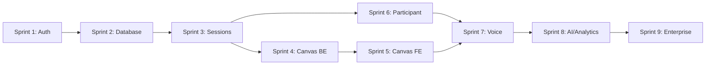

# Sprint Quick Reference Guide
## Points of You AI Studio - At-a-Glance Sprint Overview

## 📅 Sprint Timeline (18 Weeks)

```
┌─────────────────────────────────────────────────────────────────────────┐
│                        PHASE 1: FOUNDATION (6 weeks)                     │
├─────────────────────────────────────────────────────────────────────────┤
│ Sprint 1 │ Sprint 2 │ Sprint 3 │                                        │
│ Weeks 1-2│ Weeks 3-4│ Weeks 5-6│                                        │
│ Auth +   │ Auth UI +│Facilitator                                        │
│ Setup    │ Database │ Console                                           │
└──────────┴──────────┴──────────┘                                        │
                                                                           │
┌─────────────────────────────────────────────────────────────────────────┤
│ Sprint 4 │ Sprint 5 │ Sprint 6 │                                        │
│ Weeks 7-8│ Weeks 9-10│Weeks11-12                                        │
│ Canvas   │ Canvas   │Participant                                        │
│ Backend  │ Frontend │Experience                                         │
└──────────┴──────────┴──────────┘                                        │
                                                                           │
┌─────────────────────────────────────────────────────────────────────────┤
│                     PHASE 2: CORE FEATURES (4 weeks)                    │
├─────────────────────────────────────────────────────────────────────────┤
│ Sprint 7 │ Sprint 8 │                                                   │
│Weeks13-14│Weeks15-16│                                                   │
│ Voice +  │ AI Coach │                                                   │
│ Live     │Analytics │                                                   │
└──────────┴──────────┘                                                   │
                                                                           │
┌─────────────────────────────────────────────────────────────────────────┤
│                      PHASE 3: POLISH (2 weeks)                          │
├─────────────────────────────────────────────────────────────────────────┤
│ Sprint 9 │                                                              │
│Weeks17-18│                                                              │
│Enterprise│                                                              │
│& Polish  │                                                              │
└──────────┘                                                              │
```

---

## 🎯 Sprint Goals One-Pager

### Sprint 1 (Weeks 1-2): Project Foundation
**Goal**: Setup infrastructure and authentication
- ✅ Docker environment
- ✅ Django + React setup
- ✅ JWT authentication API
- ✅ Design system foundation

**Key Milestone**: Dev environment operational, users can authenticate

---

### Sprint 2 (Weeks 3-4): Authentication & Schema
**Goal**: Complete auth flow and database design
- ✅ Full auth UI (login, register, reset)
- ✅ Core database models
- ✅ Component library
- ✅ Vector database for AI

**Key Milestone**: Complete user registration and login flow

---

### Sprint 3 (Weeks 5-6): Facilitator Console
**Goal**: Build facilitator interface and session management
- ✅ Facilitator dashboard
- ✅ Session CRUD operations
- ✅ Journey builder foundation
- ✅ WebSocket infrastructure

**Key Milestone**: Facilitators can create and manage sessions

---

### Sprint 4 (Weeks 7-8): Canvas Backend
**Goal**: Canvas infrastructure and data management
- ✅ Canvas models and APIs
- ✅ Element management system
- ✅ Privacy modes
- ✅ Canvas operation tracking

**Key Milestone**: Canvas backend fully functional

---

### Sprint 5 (Weeks 9-10): Canvas Frontend
**Goal**: Interactive canvas with real-time collaboration
- ✅ Fabric.js canvas implementation
- ✅ Drawing tools
- ✅ Real-time collaboration
- ✅ Zoom screen sharing

**Key Milestone**: Fully functional collaborative canvas

---

### Sprint 6 (Weeks 11-12): Participant Experience
**Goal**: Participant dashboard and dual-mode journal
- ✅ Participant dashboard
- ✅ Dual-mode journal (standalone + in-session)
- ✅ AI journal prompts
- ✅ PWA and offline support

**Key Milestone**: Participants can journal and view progress

---

### Sprint 7 (Weeks 13-14): Voice & Live Sessions
**Goal**: Voice interface and live session features
- ✅ Voice interface for journal
- ✅ Voice commands
- ✅ Card selection system
- ✅ Live session participation

**Key Milestone**: Voice-enabled journaling and card sharing

---

### Sprint 8 (Weeks 15-16): AI Coach & Analytics
**Goal**: Complete AI integration and analytics dashboard
- ✅ AI coach chat interface
- ✅ Facilitator analytics
- ✅ AI insights generation
- ✅ Engagement metrics

**Key Milestone**: AI-powered facilitator support

---

### Sprint 9 (Weeks 17-18): Enterprise & Polish
**Goal**: Enterprise features and final optimization
- ✅ Content library
- ✅ Team management
- ✅ Admin panel
- ✅ Mobile optimization

**Key Milestone**: Production-ready system

---

## 👥 Team Capacity Per Sprint

| Role | Hours/Sprint | % Backend | % Frontend | % AI/ML |
|------|--------------|-----------|------------|---------|
| **Full-Stack Dev** | 40h | 50% | 50% | - |
| **AI Developer** | 40h | - | - | 100% |
| **UX/UI Designer** | 8-10h | - | - | - |
| **Total** | 88-90h | 20h | 20h | 40h |

---

## 📊 Sprint Velocity Estimates

```
Expected Velocity by Phase:

Foundation (Sprints 1-2):  ████████░░ 60-70%
Core Features (Sprints 3-6): █████████░ 80-90%
Advanced (Sprints 7-8):     █████████░ 80-90%
Polish (Sprint 9):          ████████░░ 70-80%
```

**Why velocity varies:**
- Sprints 1-2: Learning curve, setup overhead
- Sprints 3-6: Peak productivity, established patterns
- Sprints 7-8: Complex features but good momentum
- Sprint 9: Bug fixes, optimization, polish

---

## 🔑 Critical Path Dependencies



**Critical dependencies:**
1. Sprint 1 → Sprint 2: Auth required for database user model
2. Sprint 2 → Sprint 3: Database required for sessions
3. Sprint 4 → Sprint 5: Canvas backend required for frontend
4. Sprint 3 → Sprint 6: Sessions required for dual-mode journal
5. Sprint 6 → Sprint 7: Journal required for voice interface

---

## 🎯 Feature Delivery Timeline

| Feature | Sprint | Week | Status |
|---------|--------|------|--------|
| **Authentication** | 1-2 | 1-4 | Foundation |
| **Facilitator Console** | 3 | 5-6 | Core |
| **Session Management** | 3 | 5-6 | Core |
| **Canvas Backend** | 4 | 7-8 | Core |
| **Canvas Frontend** | 5 | 9-10 | Core |
| **Real-time Collab** | 5 | 9-10 | Core |
| **Participant Dashboard** | 6 | 11-12 | Core |
| **Dual-Mode Journal** | 6 | 11-12 | Core |
| **Voice Interface** | 7 | 13-14 | Advanced |
| **Card System** | 7 | 13-14 | Advanced |
| **AI Coach** | 8 | 15-16 | Advanced |
| **Analytics** | 8 | 15-16 | Advanced |
| **Content Library** | 9 | 17-18 | Enterprise |
| **Team Management** | 9 | 17-18 | Enterprise |

---

## 📦 Deliverable Checklist by Sprint

### Sprint 1 ✅
- [ ] Docker environment running
- [ ] Authentication API (register, login)
- [ ] React app with routing
- [ ] Design system v1
- [ ] CI/CD pipeline

### Sprint 2 ✅
- [ ] Complete auth UI
- [ ] Core database schema
- [ ] Component library (10+ components)
- [ ] Vector database operational
- [ ] Password reset flow

### Sprint 3 ✅
- [ ] Facilitator dashboard
- [ ] Session CRUD APIs
- [ ] Journey builder foundation
- [ ] WebSocket infrastructure
- [ ] AI coach backend

### Sprint 4 ✅
- [ ] Canvas backend API
- [ ] Canvas storage (PostgreSQL + S3)
- [ ] Privacy modes
- [ ] Element management
- [ ] Operation tracking

### Sprint 5 ✅
- [ ] Fabric.js canvas
- [ ] Drawing tools
- [ ] Real-time collaboration
- [ ] Zoom integration
- [ ] Cursor tracking

### Sprint 6 ✅
- [ ] Participant dashboard
- [ ] Dual-mode journal
- [ ] AI journal prompts
- [ ] Offline support (PWA)
- [ ] IndexedDB sync

### Sprint 7 ✅
- [ ] Voice interface
- [ ] Voice commands
- [ ] Card library (60+ cards)
- [ ] Card selection/sharing
- [ ] Live session features

### Sprint 8 ✅
- [ ] AI coach UI
- [ ] Analytics dashboard
- [ ] AI insights
- [ ] Engagement metrics
- [ ] Report generation

### Sprint 9 ✅
- [ ] Content library
- [ ] Team management
- [ ] Admin panel
- [ ] Mobile optimization
- [ ] Final polish

---

## 🚨 Sprint Risk Matrix

| Sprint | Risk Level | Top Risk | Mitigation |
|--------|------------|----------|------------|
| Sprint 1 | 🟡 Medium | Infrastructure setup delays | Pre-sprint Docker testing |
| Sprint 2 | 🟡 Medium | Database schema changes | Incremental migrations |
| Sprint 3 | 🟡 Medium | WebSocket complexity | Early prototype testing |
| Sprint 4 | 🟠 High | Canvas storage architecture | S3 setup in advance |
| Sprint 5 | 🔴 Critical | Real-time performance | Load testing, optimization |
| Sprint 6 | 🟡 Medium | Offline sync bugs | Thorough testing strategy |
| Sprint 7 | 🟠 High | Voice API browser support | Graceful degradation |
| Sprint 8 | 🟡 Medium | AI response accuracy | Extensive prompt testing |
| Sprint 9 | 🟢 Low | Scope creep | Strict change control |

---

## 📈 Success Metrics by Sprint

### Code Quality
```yaml
Sprint 1-3:
  Code Coverage: >70%
  Tech Debt: <30%
  
Sprint 4-6:
  Code Coverage: >75%
  Tech Debt: <25%
  
Sprint 7-9:
  Code Coverage: >80%
  Tech Debt: <20%
```

### Performance Targets
```yaml
API Response Time:
  Sprint 1-4: <500ms
  Sprint 5-9: <200ms

Page Load Time:
  Sprint 1-4: <5s
  Sprint 5-9: <2s

Canvas Operations:
  Sprint 5+: <50ms
```

### User Experience
```yaml
Lighthouse Scores (Sprint 9):
  Performance: >90
  Accessibility: >95
  Best Practices: >90
  SEO: >90
```

---

## 🎓 Sprint Ceremonies Schedule

### Week 1 of Sprint
```
Monday:     Sprint Planning (2h)
Tue-Fri:    Daily Standup (10min @ 9am)
Friday:     Backlog Refinement (1h)
```

### Week 2 of Sprint
```
Mon-Thu:    Daily Standup (10min @ 9am)
Friday:     Daily Standup (10min @ 9am)
            Sprint Review (1h @ 2pm)
            Sprint Retrospective (1h @ 3:30pm)
```

---

## 🔧 Quick Sprint Setup Checklist

**Before Sprint Starts:**
- [ ] Sprint goal defined and agreed
- [ ] Sprint backlog items selected
- [ ] All stories have acceptance criteria
- [ ] Estimates reviewed and confirmed
- [ ] Dependencies identified
- [ ] Design assets ready (if needed)
- [ ] Test environment prepared

**During Sprint:**
- [ ] Daily standups held
- [ ] Sprint board updated daily
- [ ] Blockers escalated immediately
- [ ] Code reviews within 24h
- [ ] Tests written with code

**End of Sprint:**
- [ ] Demo prepared
- [ ] Release notes drafted
- [ ] Sprint metrics collected
- [ ] Retrospective actions documented
- [ ] Next sprint backlog refined

---

## 💡 Sprint Best Practices

### ✅ Do's
- ✅ Keep daily standups to 10 minutes
- ✅ Update sprint board in real-time
- ✅ Complete peer reviews within 24h
- ✅ Write tests before marking complete
- ✅ Document decisions and learnings
- ✅ Communicate blockers immediately
- ✅ Celebrate sprint wins

### ❌ Don'ts
- ❌ Add scope mid-sprint without team agreement
- ❌ Skip retrospectives
- ❌ Let blockers sit unresolved >1 day
- ❌ Merge without code review
- ❌ Deploy on Friday afternoons
- ❌ Carry more than 20% incomplete work
- ❌ Ignore technical debt

---

## 📞 Emergency Contacts

**Blocker Escalation:**
1. Raise in daily standup (same day)
2. Slack #poi-urgent if critical
3. Tag team lead for immediate help

**Technical Issues:**
- DevOps: [Contact]
- Cloud Infrastructure: [Contact]
- AI/ML: AI Developer

**Product Questions:**
- Product Owner: [Contact]
- Design Questions: UX/UI Designer

---

## 📚 Sprint Resources

**Sprint Board**: [Jira/Linear URL]
**Documentation**: [Confluence/Notion URL]
**Code Repository**: [GitHub URL]
**CI/CD Pipeline**: [GitHub Actions URL]
**Design Files**: [Figma URL]

**Slack Channels**:
- `#poi-dev` - Development discussions
- `#poi-standup` - Daily standup notes
- `#poi-deploys` - Deployment notifications
- `#poi-urgent` - Critical issues

---

*This quick reference provides at-a-glance information for sprint execution. Refer to PLAN_SPRINT_BREAKDOWN.md for detailed sprint information.*

