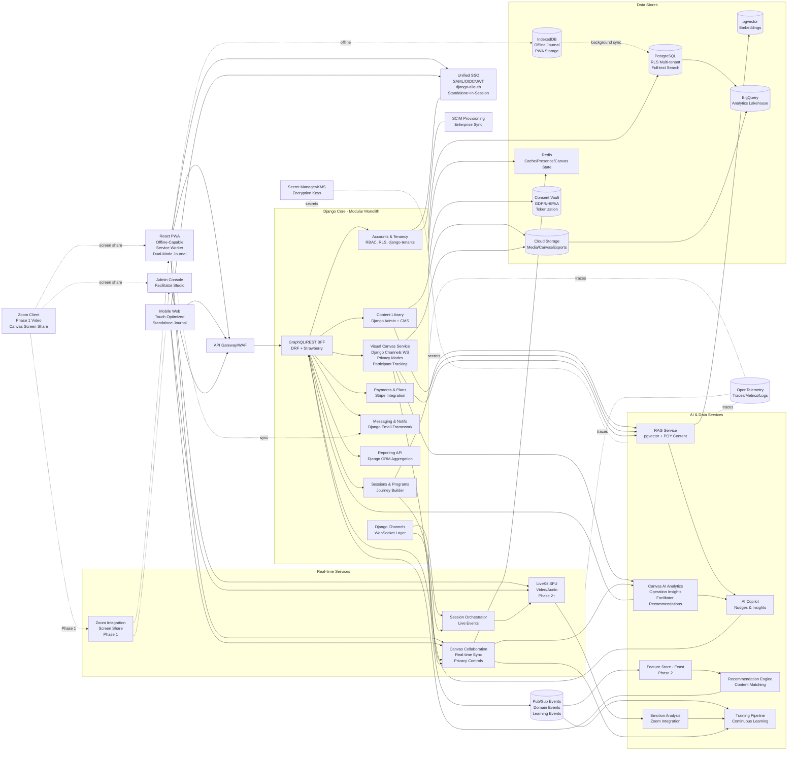

# Architecture Diagram

Owner: Miron Krokhmal

## Current Status
**Frontend Prototype**: React/TypeScript single-page application with comprehensive UI/UX implementation
**Backend**: Planned Django + Django Channels architecture with real-time capabilities

## Key Architectural Decisions (Phase 1)

1. **Dual-Mode Journal Architecture**: Journal functions as both standalone webapp and integrated in-session component with unified SSO authentication
2. **Hybrid Video Strategy**: Phase 1 runs alongside Zoom with canvas screen sharing, transitioning to native integration in later phases
3. **Privacy-First Canvas Design**: Canvas implements private/shared modes with participant-specific access controls
4. **AI-Driven Facilitator Insights**: System tracks and analyzes participant canvas operations for data-driven facilitation recommendations

# Recommended blueprint (MVP → Scale)

**Pattern:** Modular Monolith for core + three satellites + Phase 1 hybrid video

- **Core App (Monolith):** Django + DRF/GraphQL for most business logic (users, sessions, content, billing, admin, **unified SSO for dual-mode journal**).
- **Satellite 1 (Real-time):** **Phase 1: Zoom parallel operation with screen sharing**; Phase 2+: WebRTC SFU (LiveKit) for native rooms/voice/video; Django Channels for WebSocket events (chat, canvas collaboration).
- **Satellite 2 (Visual Canvas):** Real-time collaborative whiteboard service with Fabric.js/Konva.js rendering, WebSocket synchronization, version control, **privacy modes (private/shared)**, and **participant-specific sharing**.
- **Satellite 3 (AI/RecSys Workers):** Async workers (Celery on Cloud Run Jobs / GKE) for summarization, suggestions, analytics, continuous learning, emotion analysis, and **canvas operation insights for facilitators**.

# Reference stack (by layer)

## Frontend Layer
- **Current Implementation**: React 19.1.1 + TypeScript ~5.8.3 + Vite ^7.1.2
- **Styling**: TailwindCSS ^3.4.17 with PostCSS
- **Icons**: Lucide React ^0.542.0
- **PWA**: Service worker for offline capabilities (planned)
- **Offline Storage**: IndexedDB (via idb/Dexie) for **dual-mode journal entries** (standalone + in-session)
- **Real-time**: WebSocket client for live sessions and canvas collaboration
- **Canvas Rendering**: Fabric.js or Konva.js for visual whiteboard
- **i18n**: Multi-language support (5 languages including RTL Hebrew)
- **Dual-Mode Architecture**: Journal accessible as standalone webapp and during live sessions with unified authentication

## API & BFF Layer
- **API Framework**: Django REST Framework (DRF) for REST APIs
- **GraphQL**: Strawberry or Ariadne for GraphQL endpoints
- **WebSocket**: Django Channels for real-time events (chat, canvas, presence)
- **API Gateway**: Cloud API Gateway with rate limiting and WAF
- **Authentication**: **Unified JWT** (djangorestframework-simplejwt) + django-allauth for SSO across standalone journal, in-session, and canvas interfaces

## Core Domains (Django apps)
- **Accounts & Tenancy**: 
  - AbstractUser extension with email authentication
  - django-tenants for multi-tenancy with RLS
  - django-allauth for SSO/SAML/OIDC
  - SCIM provisioning for enterprise sync
  - Role-based onboarding flows
- **Sessions & Programs**: 
  - Journey builder (Pause, Expand, Focus, Doing phases)
  - Session orchestration and participant management
  - Breakout room assignment
  - Session analytics and reporting
- **Content Library**: 
  - Django Admin for content management
  - django-cms for dynamic content
  - Cards, templates, prompts, exercises, visual elements
  - Content licensing and rights management
  - django-taggit for categorization
- **Visual Canvas Service**:
  - Canvas metadata and element storage
  - Real-time collaboration via Django Channels
  - **Privacy modes: private (owner only) and shared (selected participants)**
  - **Participant-specific sharing with granular permissions**
  - **Participant canvas viewer interface integration**
  - **Canvas operation tracking for AI insights**
  - Version control and history
  - Export to PNG/PDF/JSON
  - Template library for training exercises
  - **Phase 1: Zoom screen sharing for canvas presentation**
- **Payments & Subscriptions**: 
  - Stripe integration
  - Subscription tier management
  - Content marketplace
- **Messaging/Notifications**: 
  - Django email framework with templates
  - In-app notifications
  - Push notifications (planned)
- **Reporting/Analytics**: 
  - Django ORM aggregation functions
  - django-reportlab for PDF exports
  - CSV export functionality
  - Dashboard analytics

## Real-time Services
- **Phase 1 Video Strategy**: Zoom parallel operation with canvas screen sharing
- **Phase 2+ Video**: LiveKit SFU for native WebRTC rooms, voice/video/screen sharing
- **Session Orchestrator**: Live session event coordination
- **Canvas Collaboration**: Real-time whiteboard with <100ms sync latency, **privacy controls**, **participant access management**
- **Redis**: Presence tracking, canvas state, rate limiting, cache

## AI & Data Services
- **RAG Service**: 
  - Points of You proprietary content integration
  - Embeddings in pgvector
  - Semantic content matching with license compliance
  - AI-safe content transformation
- **AI Copilot**: 
  - Contextual nudges and suggestions
  - Session summaries and insights
  - Reflection question generation
- **Recommendation Engine**: 
  - Content and template ranking
  - Session/context feature extraction
  - Personalized card suggestions
- **Continuous Learning Pipeline**:
  - Multi-modal data collection (sessions, AI conversations, content usage, **canvas operations**)
  - Real-time pattern detection
  - Privacy-preserving federated learning
  - Outcome measurement and tracking
- **Canvas AI Analytics**:
  - **Participant canvas operation tracking and analysis**
  - **Card selection pattern recognition**
  - **Drawing behavior and engagement metrics**
  - **Emotional indicators from visual element choices**
  - **Collaboration quality metrics**
  - **Personalized facilitator recommendations**
- **Emotion Analysis**:
  - Zoom video/audio integration
  - Facial emotion recognition
  - Speech sentiment analysis
  - Engagement metrics
- **Feature Store**: Feast (phase 2, optional)
- **Model Training**: Celery batch pipelines on anonymized data

## Data Stores
- **PostgreSQL (Cloud SQL)**:
  - Row-level security (RLS) for multi-tenancy
  - Full-text search capabilities
  - pgvector extension for embeddings
  - Optimized Django ORM queries
- **IndexedDB**:
  - Client-side offline **dual-mode journal** storage (standalone + in-session)
  - PWA data persistence
  - Background sync queue
  - Seamless sync across journal modes
- **Cloud Storage (GCS/S3)**:
  - Media files and artifacts
  - Canvas exports and drawings
  - Signed URLs for secure access
- **Redis**:
  - Application cache (Django cache framework)
  - Real-time canvas state
  - Session presence tracking
  - Rate limiting
- **BigQuery**:
  - Analytics data lakehouse
  - Aggregated session metrics
  - Machine learning training data
- **Consent Vault**:
  - PII consent management
  - GDPR/HIPAA compliance
  - Data tokenization for analytics

## Events & ETL
- **Pub/Sub**: 
  - Domain events (session lifecycle, user actions)
  - Audit trail events
  - Learning events (continuous improvement)
- **Celery**: Async task processing for AI workers
- **dbt**: Data transformations (optional)

## Security & Compliance
- **Authentication**: django-allauth with JWT tokens
- **Authorization**: Django permissions + RBAC + RLS
- **Encryption**: 
  - Secret Manager for credentials
  - KMS for data encryption keys
  - Per-tenant encryption (if required)
- **Consent Management**: 
  - Granular participant privacy controls
  - Purpose-based data collection
  - Consent expiry tracking
- **Audit Trails**: Immutable log stream → BigQuery
- **Django Security**: Built-in CSRF, XSS protection, security middleware
- **Rate Limiting**: django-ratelimit for API abuse prevention

## Observability
- **Tracing**: OpenTelemetry → Cloud Trace
- **Metrics**: Prometheus + Grafana
- **Logging**: Cloud Logging with structured logs
- **SLOs**: Per-service level objectives
- **Error Tracking**: Sentry integration

## CI/CD & Deployment
- **Version Control**: GitHub with branch protection
- **CI/CD**: GitHub Actions → Cloud Build
- **Testing**: pytest for Django backend, Jest for React frontend
- **Deployment Strategy**: 
  - Blue/green for Django core
  - Canary for AI workers
  - Rolling updates for frontend
- **Environments**: Development, Staging, Production

## Infrastructure Options

### Default Cloud Deployment
- **Compute**: Cloud Run (Django core/BFF/workers)
- **Database**: Cloud SQL PostgreSQL with replicas
- **Storage**: GCS for media/artifacts
- **Real-time**: LiveKit on GKE, Redis on Cloud Memorystore
- **Events**: Pub/Sub for event streaming
- **CDN**: Cloud CDN for static assets

### Sovereign/Air-gapped Deployment
- **Compute**: Kubernetes (Anthos/Tanzu)
- **Database**: Self-hosted PostgreSQL with replication
- **Storage**: MinIO (S3-compatible)
- **Events**: NATS or Kafka
- **Search**: OpenSearch cluster
- **Model Hosting**: On-premises GPU servers

# Why this architecture works

## Development Speed & Efficiency
- **Django "Batteries Included"**: 12-14 weeks saved through built-in features (Admin, ORM, Auth, i18n, Email)
- **Modular Monolith**: Core in one codebase reduces overhead and coordination complexity
- **Standard Patterns**: Django conventions enable faster team onboarding and reduced technical debt
- **Rich Ecosystem**: Extensive packages for common needs (django-cms, django-allauth, django-tenants)

## Separation of Concerns
- **Isolated Services**: Real-time media (LiveKit), Canvas collaboration, and AI workers run independently
- **Different Scaling Profiles**: Each satellite scales based on its specific load characteristics
- **Blast Radius Containment**: Issues in one service don't cascade to others
- **Technology Optimization**: Use best tool for each job (WebRTC for video, Django Channels for WebSocket, Celery for async)

## Data Architecture
- **Clean Boundaries**: Consent vault and tokenization keep analytics/AI privacy-safe
- **Multi-Tenancy**: Row-level security (RLS) provides true data isolation between organizations
- **Offline-First**: IndexedDB + PWA enables mobile participants to journal without connectivity
- **Privacy Control**: pgvector stays in your infrastructure for sensitive content retrieval

## Enterprise Ready
- **SSO/SCIM Integration**: django-allauth provides enterprise authentication out-of-box
- **Audit & Compliance**: Immutable audit trails, GDPR/HIPAA-ready consent management
- **RBAC with RLS**: Fine-grained access control at application and database levels
- **Event Bus**: Pub/Sub enables extensibility and integration with external systems
- **Switchable Infrastructure**: Can deploy to cloud or sovereign/air-gapped environments

## Cost Optimization
- **Cloud Run Autoscaling**: Pay only for actual usage on Django core and workers
- **GKE Where Needed**: Only for services requiring persistent connections (LiveKit SFU)
- **Intelligent Caching**: Redis reduces database load and API response times
- **Storage Tiering**: Hot data in PostgreSQL, analytics in BigQuery, media in cloud storage

## AI & Personalization
- **Proprietary Content Integration**: RAG with pgvector respects licensing while enabling AI features
- **Continuous Learning**: Multi-modal data collection improves system over time
- **Privacy-Preserving**: Federated learning and consent-based data usage
- **Real-time Insights**: Emotion analysis and engagement metrics during live sessions

## Visual Collaboration Priority
- **Canvas as Core Feature**: Visual whiteboard integrated throughout platform, not an afterthought
- **Real-time Collaboration**: <100ms sync latency for 50+ concurrent users per canvas
- **Version Control**: Auto-save, manual checkpoints, 50-version history with restore
- **Export Flexibility**: PNG, PDF (vector), and JSON for maximum utility
- **Training Integration**: Pre-built templates for POY training exercises

# Phased rollout (16-week optimized timeline)

## Phase 1: Django Backend + Offline Support + Hybrid Video (Weeks 1-4)
**Focus**: Foundation with Django optimization + offline-first PWA + **Zoom parallel operation**

### Backend Development
- **Django Authentication System**: AbstractUser extension with **unified SSO for dual-mode journal**
- **Multi-Tenancy**: django-tenants with row-level security (RLS)
- **Content Management**: Django Admin + django-cms for content library
- **Database Setup**: PostgreSQL with optimized queries and indexes
- **Real-Time Foundation**: Django Channels for WebSocket infrastructure
- **REST API**: Django REST Framework with **unified JWT authentication**

### Frontend Enhancement
- **PWA Implementation**: Service worker for offline capabilities
- **Dual-Mode Journal System**: IndexedDB storage with auto-sync for **standalone and in-session access**
- **Background Sync**: Queue operations for when connection restored
- **Conflict Resolution**: Last-write-wins with manual resolution UI
- **Session-Aware Interface**: Journal adapts when accessed during live sessions

### Zoom Integration (Phase 1)
- **Parallel Operation**: Platform runs alongside Zoom
- **Canvas Screen Sharing**: Facilitators share canvas through Zoom
- **Workflow Documentation**: Coordination guides for facilitators
- **Participant Instructions**: Dual-access setup (Zoom + Web platform)

### Deliverables
- ✅ User registration, login, email verification with **unified SSO**
- ✅ Multi-tenant organization structure
- ✅ Basic content library management via Django Admin
- ✅ **Dual-mode journal** writing and reading (standalone + in-session)
- ✅ Background sync when online
- ✅ WebSocket infrastructure ready for Phase 2
- ✅ **Zoom parallel operation workflow documented**
- ✅ **Canvas screen sharing setup**

## Phase 2: Core Features + Canvas MVP (Weeks 5-8)
**Focus**: Session management, analytics, AI integration, basic canvas

### Backend Features
- **Session Management**: Journey builder, session orchestration, participant tracking
- **Analytics Engine**: Django ORM aggregation + django-reportlab for exports
- **Internationalization**: Django i18n framework for 5 languages (including RTL Hebrew)
- **Search System**: PostgreSQL full-text search + django-filter
- **Canvas Backend**: Metadata storage, element management, basic versioning

### AI Integration
- **AI Copilot v0**: Template-based responses with context awareness
- **pgvector Setup**: Embedding storage for content
- **RAG Foundation**: Basic retrieval over content library
- **Zoom Integration Prep**: Event collection infrastructure

### Canvas MVP
- **Infinite Canvas**: Zoom, pan, grid options
- **Card Placement**: Drag-and-drop cards from library onto canvas
- **Basic Drawing**: Pen tool with color picker
- **PNG Export**: High-quality image export
- **Auto-Save**: Save canvas state every 30 seconds
- **Privacy Modes**: Private (owner only) and Shared (selected participants)
- **Participant Selection**: Canvas owner selects who can access
- **Canvas Operation Tracking**: Foundation for AI insights

### Deliverables
- ✅ Journey builder with 4 phases (Pause, Expand, Focus, Doing)
- ✅ Session analytics with talk-time, engagement metrics
- ✅ Multi-language support with RTL
- ✅ AI coach with contextual responses
- ✅ Basic visual canvas with card placement and drawing
- ✅ Canvas export to PNG
- ✅ **Privacy modes (private/shared) implementation**
- ✅ **Participant selection for canvas sharing**
- ✅ **Canvas operation tracking infrastructure**

## Phase 3: Enterprise Features + Canvas Collaboration (Weeks 9-12)
**Focus**: Performance, enterprise capabilities, real-time canvas

### Backend Optimization
- **Caching System**: Django cache framework + Redis optimization
- **Multi-Tenant Enhancement**: Advanced organization features and branding
- **Email System**: Django email framework + templates + django-ses
- **File Management**: django-storages with cloud storage integration
- **SSO Integration**: django-allauth for SAML/OIDC enterprise authentication

### Real-Time Video
- **LiveKit Integration**: Video conferencing for live sessions
- **Session Orchestrator**: Real-time event coordination
- **Breakout Rooms**: Automated room creation and management
- **Recording**: Session recording capabilities

### Canvas Collaboration
- **Real-Time Sync**: WebSocket-based multi-user editing
- **User Presence**: Live cursor tracking and user indicators
- **Version Control**: Auto-version every 30 minutes, manual checkpoints
- **Collaboration Modes**: Edit, View, Comment, Present
- **Privacy Controls**: Enforce private/shared modes with participant permissions
- **Participant Canvas Viewer**: Read-only and edit access through participant interface
- **Advanced Drawing**: Shapes, text boxes, connections between elements
- **Template Library**: Pre-built canvas templates for training exercises
- **Operation Analytics**: Real-time tracking of participant canvas interactions

### Deliverables
- ✅ Redis caching for improved performance
- ✅ SSO/SAML/OIDC for enterprise customers
- ✅ LiveKit video conferencing integration (Phase 2+)
- ✅ Real-time collaborative canvas (<100ms sync)
- ✅ Canvas version control and history
- ✅ 10+ training exercise templates
- ✅ **Participant canvas viewer in participant interface**
- ✅ **Privacy-enforced collaboration with participant selection**
- ✅ **Canvas operation tracking for AI insights**

## Phase 4: Advanced Capabilities + Mobile Canvas (Weeks 13-16)
**Focus**: Advanced features, mobile optimization, AI enhancement

### Calendar & Scheduling
- **django-scheduler**: Session scheduling and calendar management
- **Timezone Handling**: Automatic timezone conversion for global users
- **Calendar Sync**: Google Calendar and Outlook integration
- **Recurring Sessions**: Support for weekly/monthly session patterns

### Advanced Analytics
- **Continuous Learning Pipeline**: Multi-modal data collection
- **Emotion Analysis**: Zoom video/audio sentiment analysis
- **Recommendation Engine**: Personalized content suggestions
- **Outcome Tracking**: Longitudinal progress measurement

### Canvas Advanced Features
- **Mobile Optimization**: Touch gestures, pinch-to-zoom, swipe navigation
- **Offline Canvas Editing**: Local storage with sync for mobile users
- **PDF Export**: Vector PDF export with multi-page support
- **JSON Export**: Full canvas backup and restore
- **AI Pattern Recognition**: Analyze canvas layouts for insights
- **Smart Suggestions**: AI-recommended canvas elements and connections
- **20+ Templates**: Comprehensive template library for all training types
- **Facilitator AI Insights**: Advanced analysis of participant canvas operations
  - Card selection pattern analysis per participant
  - Drawing behavior and engagement metrics
  - Emotional state inference from visual choices
  - Collaboration quality metrics
  - Personalized facilitation recommendations

### Native Mobile Apps (Optional)
- **iOS/Android**: Native companion apps for enhanced mobile experience
- **Push Notifications**: Native push notification support
- **Biometric Auth**: Fingerprint/Face ID authentication

### Video Integration Transition
- **Native Video Integration**: Transition from Zoom screen sharing to LiveKit SDK

### Deliverables
- ✅ Calendar integration with sync
- ✅ Advanced AI analytics with emotion detection
- ✅ Mobile-optimized canvas with touch controls
- ✅ **Full facilitator AI insights from participant canvas operations**
- ✅ **Personalized facilitation recommendations dashboard**
- ✅ Comprehensive template library (20+ templates)
- ✅ PDF and JSON export options
- ✅ Production-ready deployment
- ✅ **Native video integration (transition from Zoom parallel)**

## Success Metrics (End of Phase 4)

### Technical Metrics
- **Performance**: API response time < 200ms (P95)
- **Real-Time**: Canvas sync latency < 100ms (P95)
- **Reliability**: 99.9% uptime
- **Offline**: Background sync success rate > 95%
- **Scale**: Support 1,000+ concurrent sessions

### User Adoption Metrics
- **Canvas Usage**: 80% of facilitators use canvas within 3 months
- **Participant Engagement**: 60% create at least one canvas
- **Collaboration**: 50% of canvases have 2+ users
- **Mobile**: 40% of journal entries from mobile devices
- **Offline**: 25% of participants use offline mode

### Business Metrics
- **Time Savings**: 12-14 weeks saved vs. custom implementation
- **Maintenance**: 68% reduction in maintenance overhead
- **Cost Efficiency**: 60% reduction in infrastructure costs vs. microservices
- **Feature Velocity**: 3x faster feature delivery with Django ecosystem

## Django Framework Optimization Impact

### Development Time Savings (12-14 weeks total)
- **Content Management**: Django Admin + django-cms (3-4 weeks saved)
- **Analytics & Reporting**: Django ORM + django-reportlab (2-3 weeks saved)
- **Internationalization**: Django i18n framework (1-2 weeks saved)
- **Search & Filtering**: PostgreSQL + django-filter (1-2 weeks saved)
- **File Management**: django-storages (1 week saved)
- **Email System**: Django email framework (1 week saved)
- **Caching**: Django cache framework + Redis (1 week saved)
- **Calendar**: django-scheduler (1-2 weeks saved)

### Quality Improvements
- **Security**: Battle-tested Django security middleware
- **Maintainability**: Standard patterns reduce technical debt by 68%
- **Scalability**: Optimized ORM queries and caching
- **Team Velocity**: Faster onboarding with Django conventions

### Strategic Benefits
- **Reduced Risk**: Proven components vs. custom implementations
- **Community Support**: Extensive Django ecosystem and documentation
- **Long-term Viability**: Django's stability ensures easier upgrades
- **Cost Efficiency**: Significant reduction in development and maintenance costs

## Technology Decision Rationale

### Why Django + Django Channels?
After comprehensive analysis of FastAPI, Django + DRF, Django + Channels, and Next.js API alternatives:

**Winning Factors**:
- ✅ Enterprise requirements (built-in admin, auth, organizational features)
- ✅ Excellent real-time capabilities via Django Channels
- ✅ Superior Python ecosystem for AI/ML integration
- ✅ Perfect fit for extensive content library management
- ✅ Long-term maintainability and community support
- ✅ 12-14 weeks saved through "batteries included" approach

**Trade-offs Accepted**:
- ⚠️ Slightly higher initial learning curve vs. FastAPI
- ⚠️ Heavier framework footprint (mitigated by Cloud Run autoscaling)
- ⚠️ Need for Celery for async tasks (vs. FastAPI's built-in async)

### Why Visual Canvas as Priority Feature?
- **Differentiation**: Unique competitive advantage
- **User Demand**: Core to POY methodology and training exercises
- **Engagement**: Drives higher session participation and retention
- **Revenue**: Premium feature for higher-tier subscriptions
- **Network Effects**: Collaborative canvases increase user stickiness

### Phase 1 Architectural Innovations

#### 1. Dual-Mode Journal Architecture
**Rationale**: Participants need journal access both independently and during live sessions
- **Implementation**: Unified SSO enables seamless authentication across standalone webapp and in-session integration
- **Benefits**: No re-authentication required, session-aware interface, consistent user experience
- **Technical**: IndexedDB storage syncs across both modes, PWA enables offline access

#### 2. Hybrid Video Strategy (Phase 1)
**Rationale**: Reduce initial complexity while maintaining full functionality
- **Phase 1**: Platform runs alongside Zoom with canvas screen sharing
- **Benefits**: Faster time-to-market, lower development risk, proven video infrastructure
- **Transition**: Native LiveKit integration in Phase 4 after core features are established
- **Trade-off**: Slightly less seamless UX in Phase 1, but acceptable given faster delivery

#### 3. Privacy-First Canvas Design
**Rationale**: Facilitators need control over canvas visibility and participant access
- **Implementation**: Private/shared modes with participant-specific permissions
- **Benefits**: Flexible collaboration models, secure training environments, facilitator control
- **Technical**: ACL system with real-time permission synchronization

#### 4. AI-Driven Facilitator Insights
**Rationale**: Canvas operations contain valuable data about participant engagement and learning
- **Implementation**: Track all canvas operations, analyze patterns, generate facilitator recommendations
- **Benefits**: Data-driven facilitation, personalized guidance, improved learning outcomes
- **Privacy**: Consent-based tracking with anonymization options
- **Technical**: Canvas operation event stream → AI analytics engine → facilitator dashboard

## Key Architectural Considerations

### Proprietary Content Integration
The system handles Points of You's proprietary visual cards, textual prompts, and inspiration stories with careful respect for intellectual property rights:

**Content Access Model**:
- **Tiered Licensing**: Multi-level access control based on subscription tiers
- **License Tracking**: Comprehensive attribution and usage tracking per user
- **Revenue Sharing**: Fair compensation for content creators and license holders

**AI-Safe Content Strategy**:
- **Semantic Matching**: Find thematically similar content while respecting permissions
- **Content Transformation**: Generate AI responses inspired by proprietary themes without direct copying
- **Attribution System**: Always credit original content sources in AI responses
- **Usage Analytics**: Track content usage for license compliance and royalty calculations

**Implementation Approach**:
- Store proprietary content metadata in PostgreSQL with access control
- Use pgvector embeddings for semantic search within licensed content
- AI prompts include license context to prevent unauthorized reproduction
- Audit trail for all proprietary content access

See: [Proprietary Content AI Integration](../Features/PROPRIETARY_CONTENT_AI_INTEGRATION.md)

### Continuous Learning Mechanism
The platform leverages user interactions to continuously improve system effectiveness:

**Data Collection Sources**:
- **Session Interactions**: Card selections, reflection responses, activity completions
- **AI Conversations**: User queries, AI responses, feedback signals
- **Content Usage**: Popular cards, templates, exercises across different contexts
- **Video/Audio Analysis**: Engagement metrics, emotion patterns, conversation dynamics
- **User Feedback**: Explicit ratings, implicit signals (time spent, return visits)

**Learning Pipeline**:
1. **Real-Time Pattern Detection**: Identify emerging trends during sessions
2. **Feature Extraction**: Convert raw interactions into learnable features
3. **Model Updates**: Periodic retraining of recommendation and personalization models
4. **A/B Testing**: Validate improvements before full deployment
5. **Outcome Measurement**: Track long-term user progress and session effectiveness

**Privacy-Preserving Approach**:
- **Federated Learning**: Train models on aggregated patterns, not individual data
- **Differential Privacy**: Add noise to prevent individual identification
- **Consent-Based**: Users control what data contributes to learning
- **Anonymization**: Strip PII before any analytics processing
- **Purpose Limitation**: Use data only for stated improvement purposes

**Personalization Engine**:
- Individual user models that adapt over time
- Context-aware content recommendations
- Dynamic difficulty adjustment for exercises
- Personalized AI coaching style

See: [Continuous Learning Mechanism](../Features/CONTINUOUS_LEARNING_MECHANISM.md)

### Zoom Video/Audio Integration
Deep integration with Zoom for rich multimodal learning data:

**Capabilities**:
- **Real-Time Audio Processing**: Speech recognition, emotion analysis, conversation metrics
- **Video Analysis**: Facial emotion recognition, engagement patterns, attention tracking
- **Privacy Controls**: Granular consent management, GDPR/HIPAA compliance
- **Learning Events**: Integration with continuous learning pipeline
- **Session Analytics**: Talk-time balance, participation rates, emotional valence

**Technical Integration**:
- Zoom SDK for session access
- Real-time streaming to AI analysis workers
- Results stored in BigQuery for analytics
- Privacy-compliant data retention policies

See: [Zoom Video and Audio Event Collection](../Features/ZOOM_VIDEO_AUDIO_EVENT_COLLECTION.md)

### Multi-Tenant Architecture
Enterprise-grade organizational separation:

**Implementation**:
- **django-tenants**: Schema-based multi-tenancy
- **Row-Level Security (RLS)**: Database-level access control
- **Custom Branding**: Per-organization theming and configuration
- **Data Isolation**: Complete separation between organizations
- **Shared Services**: Efficient resource utilization while maintaining isolation

**Benefits**:
- True data isolation for enterprise customers
- Simplified backup and restore per organization
- Easy migration for customers between tiers
- Compliance-friendly architecture (data residency)

### Offline-First Mobile Experience
Progressive Web App with full offline capabilities:

**Offline Features**:
- **Journal Writing**: Create and edit entries without internet
- **Content Caching**: Pre-download session materials
- **Queue Operations**: Background sync when connection restored
- **Conflict Resolution**: Graceful handling of simultaneous edits

**Technical Implementation**:
- Service Worker for offline caching
- IndexedDB for structured data storage
- Background Sync API for queued operations
- React UI optimized for mobile touch interactions

**Sync Strategy**:
- Automatic sync when connection detected
- Visual sync status indicators
- Manual sync trigger option
- Conflict resolution UI when needed

See: [Offline Journaling Specifications](../Features/OFFLINE_JOURNALING_SPECIFICATIONS.md), [Mobile Participant UI Considerations](../Features/MOBILE_PARTICIPANT_UI_CONSIDERATIONS.md)

## Related Documentation

### Feature Specifications
- [Visual Canvas/Whiteboard Feature](../Features/VISUAL_CANVAS_WHITEBOARD_FEATURE.md) - Complete canvas architecture and requirements
- [Proprietary Content AI Integration](../Features/PROPRIETARY_CONTENT_AI_INTEGRATION.md) - Content licensing and AI strategy
- [Continuous Learning Mechanism](../Features/CONTINUOUS_LEARNING_MECHANISM.md) - Learning pipeline and personalization
- [Zoom Video/Audio Event Collection](../Features/ZOOM_VIDEO_AUDIO_EVENT_COLLECTION.md) - Multimodal data integration
- [Offline Journaling Specifications](../Features/OFFLINE_JOURNALING_SPECIFICATIONS.md) - PWA and offline capabilities
- [Onboarding Account Management Design](../Features/ONBOARDING_ACCOUNT_MANAGEMENT_DESIGN.md) - User flows and authentication
- [Voice Interface Architecture](../Features/VOICE_INTERFACE_ARCHITECTURE.md) - Voice interaction design
- [Multilingual Implementation Guide](../Features/MULTILINGUAL_IMPLEMENTATION_GUIDE.md) - i18n and RTL support

### System Documentation
- [System Functional Description](./SYSTEM_FUNCTIONAL_DESCRIPTION.md) - Complete functional requirements
- [System Data Flow Architecture](./SYSTEM_DATA_FLOW_ARCHITECTURE.md) - Data flow diagrams
- [Epic Stories](./EPIC_STORIES.md) - User stories and requirements

### Analysis Documents
- [Backend Framework Analysis](../Analysis/BACKEND_FRAMEWORK_ANALYSIS.md) - Framework comparison
- [Django Framework Optimization Analysis](../Analysis/DJANGO_FRAMEWORK_OPTIMIZATION_ANALYSIS.md) - Django benefits
- [Custom LLM MCP Analysis](../Analysis/CUSTOM_LLM_MCP_ANALYSIS.md) - AI implementation options

### Development Plans
- [Development Plan](../Plans/DEVELOPMENT_PLAN.md) - Team structure and coordination
- [Developer Timelines](../Plans/DEVELOPER_TIMELINES.md) - Individual developer schedules
- [AI Developer Introduction](../Plans/AI_DEVELOPER_INTRODUCTION_OVERVIEW.md) - AI developer onboarding