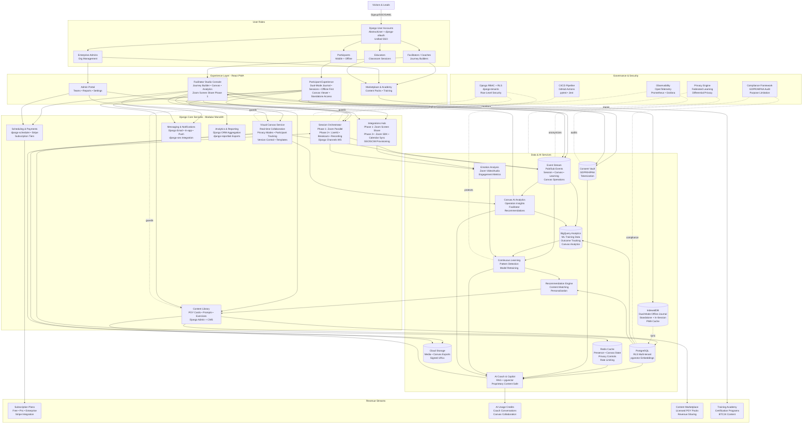

# System Data Flow Architecture

Owner: Miron Krokhmal

## Overview
This document describes the high-level architecture and data flows for Points of You AI Studio, a Django-based platform that digitizes and enhances the Points of You methodology with AI-powered coaching, real-time collaboration, and offline-first mobile capabilities.

**Current Status**: Frontend prototype (React/TypeScript). Backend implementation planned with Django + Django Channels.

## Key Architectural Decisions (Phase 1)

1. **Dual-Mode Journal Architecture**: Journal functions as both standalone webapp and integrated in-session component with unified SSO authentication
2. **Hybrid Video Strategy**: Phase 1 runs alongside Zoom with canvas screen sharing, transitioning to native integration in later phases
3. **Privacy-First Canvas Design**: Canvas implements private/shared modes with participant-specific access controls
4. **AI-Driven Facilitator Insights**: System tracks and analyzes participant canvas operations for data-driven facilitation recommendations

## High-Level Data Flow Diagram



## Detailed Data Flow Descriptions

### 1. User Authentication & Onboarding Flow (Unified SSO)

**Entry Point**: Visitors & Leads → Django User Accounts

**Technology**: Django AbstractUser + django-allauth + **Unified JWT**

**Flow**:
1. **Registration**: Email-based signup with verification token
2. **SSO/SAML**: Enterprise authentication via django-allauth
3. **Role Assignment**: Facilitator, Participant, Admin, or Educator
4. **Onboarding**: Role-specific setup flows
5. **Multi-Tenancy**: Organization assignment via django-tenants
6. **Unified Token Generation**: Single JWT valid for standalone journal, in-session, and canvas access
7. **Session Context Detection**: System identifies standalone vs. in-session mode

**Data Stored**: 
- User credentials (hashed passwords)
- Profile information (name, language, timezone)
- Organization membership
- Role permissions (Django groups)
- Email verification status
- **Authentication tokens (JWT with extended scope)**
- **Session context preferences**

**Related Documentation**: [Onboarding Account Management Design](../Features/ONBOARDING_ACCOUNT_MANAGEMENT_DESIGN.md)

---

### 2. Facilitator Journey Builder Flow

**Entry Point**: Facilitator → Studio Console → Session Orchestrator + Visual Canvas

**Technology**: React components + Django REST Framework + Django Channels

**Flow**:
1. **Journey Design**: Create phases (Pause, Expand, Focus, Doing)
2. **Element Selection**: Add cards, prompts, exercises from content library
3. **Canvas Setup**: Configure visual whiteboard templates
4. **Session Scheduling**: Set date/time via django-scheduler
5. **Participant Invitation**: Send notifications via Django email framework
6. **Live Session**: WebSocket connection via Django Channels
7. **Canvas Collaboration**: Real-time sync via Redis + WebSocket

**Data Stored**:
- Journey metadata (name, description, goals)
- Phase configuration (elements, timing, instructions)
- Canvas templates and layouts
- Session schedule and invitations
- Real-time canvas state in Redis

**Data Flow**:
```
Facilitator → E1 (Studio Console)
E1 → S3 (Content Library) → D2 (PostgreSQL)
E1 → S2 (Canvas Service) → D6 (Redis) → D3 (Cloud Storage)
E1 → S1 (Session Orchestrator) → D1 (Event Stream)
```

**Related Documentation**: [System Functional Description](./SYSTEM_FUNCTIONAL_DESCRIPTION.md), [Visual Canvas Feature](../Features/VISUAL_CANVAS_WHITEBOARD_FEATURE.md)

---

### 3. Participant Dual-Mode Offline Journal Flow

**Entry Point**: Participant → Standalone Webapp OR In-Session → IndexedDB → Background Sync

**Technology**: React PWA + Service Worker + IndexedDB + Background Sync API + **Unified Authentication**

**Flow**:
1. **Mode Detection**: System identifies standalone or in-session context
2. **Unified Auth**: Single JWT authenticates both modes
3. **Offline Write**: Create journal entry in IndexedDB (either mode)
4. **Auto-Save**: Local persistence every 30 seconds
5. **Session-Aware Interface**: UI adapts for in-session reflections
6. **Connection Detection**: Monitor network status
7. **Background Sync**: Queue operations when offline
8. **Sync Execution**: Upload to PostgreSQL when online (preserves mode context)
9. **Conflict Resolution**: Handle simultaneous edits across modes

**Data Stored**:
- **Dual-mode journal entries** (standalone + in-session, local IndexedDB, synced to PostgreSQL)
- **Session context** (when written during live sessions)
- Reflection prompts (cached from server)
- Session materials (pre-downloaded)
- Sync queue (pending operations)
- **Mode metadata** (standalone vs. in-session)

**Data Flow**:
```
Participant → E2 (Standalone OR In-Session) → D4 (Dual-Mode IndexedDB)
D4 --(offline)--> Local Storage (with mode context)
D4 --(online)--> D2 (PostgreSQL) [mode preserved]
Unified JWT → Both modes seamlessly
```

**Related Documentation**: [Offline Journaling Specifications](../Features/OFFLINE_JOURNALING_SPECIFICATIONS.md), [Mobile UI Considerations](../Features/MOBILE_PARTICIPANT_UI_CONSIDERATIONS.md)

---

### 4. Live Session Real-Time Flow (Hybrid Video Phase 1)

**Entry Point**: Facilitator/Participant → Session Orchestrator → **Phase 1: Zoom + Web Platform** / Phase 2+: LiveKit + Django Channels

**Technology**: **Phase 1**: Zoom (external) + Django Channels + Redis; **Phase 2+**: LiveKit SFU + Django Channels + Redis

**Flow (Phase 1)**:
1. **Session Start**: WebSocket connection established for platform features
2. **Video/Audio**: Zoom meeting (external, parallel operation)
3. **Canvas Screen Sharing**: Facilitator shares canvas via Zoom screen share
4. **Chat/Events**: WebSocket messages via Django Channels (platform)
5. **Card Selection**: Real-time updates broadcast to all participants
6. **Breakout Rooms**: Managed through Zoom
7. **Canvas Collaboration**: Multi-user drawing with <100ms sync (web platform)
8. **Dual-Mode Journal Access**: Participants access journal during session with unified auth
9. **Recording**: Zoom native recording

**Flow (Phase 2+)**:
1. **Native Video**: WebRTC media through LiveKit SFU
2. **Integrated Canvas**: No screen sharing needed, native integration
3. **Platform-Managed Breakout Rooms**: Dynamic room creation and assignment

**Data Stored**:
- Active session state (Redis)
- Participant presence (Redis)
- Chat messages (PostgreSQL)
- Canvas updates (Redis → PostgreSQL → Cloud Storage)
- **Canvas operation events** (for AI insights)
- Video recordings (Phase 1: Zoom, Phase 2+: Cloud Storage)
- Session events (Pub/Sub → BigQuery)
- **Journal entries with session context** (PostgreSQL)

**Data Flow (Phase 1)**:
```
E1/E2 → S1 (Session Orchestrator) → Zoom (external)
E1 → Zoom Screen Share → Canvas display
E1/E2 → Django Channels → D6 (Redis)
S1 → D1 (Event Stream) → D11 (BigQuery)
S2 (Canvas) → D6 (Redis) → D3 (Cloud Storage)
S2 (Canvas) → D12 (Canvas AI Analytics)
E2 → D4 (Dual-Mode Journal) [in-session mode]
```

**Related Documentation**: [System Functional Description](./SYSTEM_FUNCTIONAL_DESCRIPTION.md), [Visual Canvas Feature](../Features/VISUAL_CANVAS_WHITEBOARD_FEATURE.md)

---

### 5. Visual Canvas Collaboration Flow (Privacy-First with AI Insights)

**Entry Point**: Facilitator/Participant → Visual Canvas Service → Real-time Sync

**Technology**: Fabric.js/Konva.js + Django Channels + Redis + PostgreSQL + **Privacy Controls** + **AI Analytics**

**Flow**:
1. **Canvas Load**: Retrieve canvas data from PostgreSQL
2. **Privacy Check**: Verify user permissions (private/shared mode, participant list)
3. **Element Rendering**: Client-side rendering with Fabric.js/Konva.js
4. **User Actions**: Drawing, card placement, element manipulation
5. **Operation Tracking**: Log participant canvas operations for AI insights
6. **Real-Time Broadcast**: WebSocket message to authorized users only
7. **State Sync**: Redis stores current canvas state with privacy context
8. **Persistence**: Periodic save to PostgreSQL
9. **Version Control**: Auto-version every 30 minutes
10. **Participant Access**: Shared canvases visible in participant interface
11. **AI Analysis**: Canvas operations analyzed for facilitator insights
12. **Export**: PNG/PDF/JSON generation on demand (respects privacy)

**Data Stored**:
- Canvas metadata (id, name, owner, permissions, **privacy_mode**, **shared_with_participants**) → PostgreSQL
- Canvas elements (cards, shapes, text, drawings) → PostgreSQL
- Real-time state (active users, cursors, **privacy context**) → Redis
- Version history (snapshots) → PostgreSQL
- **Canvas operation events** (participant actions, timestamps) → PostgreSQL + BigQuery
- Export files → Cloud Storage
- **AI insights** (patterns, recommendations) → PostgreSQL

**Data Flow**:
```
E1/E2 → S2 (Canvas Service)
S2 → Privacy Check → Access Control List
S2 → D6 (Redis) [real-time state + privacy]
S2 → D2 (PostgreSQL) [persistence + privacy settings]
S2 → D3 (Cloud Storage) [exports]
S2 → D1 (Event Stream) [canvas operations]
S2 → D12 (Canvas AI Analytics) [operation tracking]
D12 → E1 (Facilitator Dashboard) [AI insights]
E2 (Participant) → S2 [shared canvas viewer]
```

**Privacy Modes**:
- **Private**: Canvas visible only to owner
- **Shared**: Canvas accessible to selected participants (view or edit permissions)

**Performance Requirements**:
- Sync latency: < 100ms (P95)
- Concurrent users: 50+ per canvas
- Auto-save: Every 30 seconds
- Version snapshots: Every 30 minutes
- **Privacy check latency**: < 10ms
- **AI insight generation**: < 5 seconds

**Related Documentation**: [Visual Canvas/Whiteboard Feature](../Features/VISUAL_CANVAS_WHITEBOARD_FEATURE.md)

---

### 6. AI Coach & Copilot Flow

**Entry Point**: Facilitator/Participant → AI Coach → RAG + pgvector

**Technology**: OpenAI API + pgvector + Django + Celery

**Flow**:
1. **User Query**: Question or reflection request
2. **Context Gathering**: Retrieve user history, session context
3. **Content Retrieval**: RAG search in pgvector embeddings
4. **License Check**: Verify proprietary content access permissions
5. **Prompt Engineering**: Construct LLM prompt with context
6. **LLM Call**: OpenAI API request (async via Celery)
7. **Response Processing**: Format and attribute content sources
8. **Usage Tracking**: Log for billing and analytics

**Data Stored**:
- Conversation history (PostgreSQL)
- Content embeddings (pgvector)
- License permissions (PostgreSQL)
- Usage metrics (PostgreSQL → BigQuery)
- AI responses (PostgreSQL)

**Data Flow**:
```
E1/E2 → D7 (AI Coach)
D7 → D2 (PostgreSQL) [context + embeddings]
D7 → D5 (Consent Vault) [privacy check]
D7 → D6 (Redis) [caching]
D7 → OpenAI API [LLM]
D7 → S1 (Session) [nudges]
D7 → D1 (Event Stream) [learning]
```

**Privacy Controls**:
- Consent-based data usage
- PII anonymization before LLM calls
- Proprietary content transformation (not direct copying)
- License compliance tracking

**Related Documentation**: [Proprietary Content AI Integration](../Features/PROPRIETARY_CONTENT_AI_INTEGRATION.md), [Custom LLM Analysis](../Analysis/CUSTOM_LLM_MCP_ANALYSIS.md)

---

### 7. Continuous Learning Pipeline Flow

**Entry Point**: Event Stream → Pattern Detection → Model Retraining

**Technology**: Pub/Sub + BigQuery + Celery + scikit-learn/PyTorch

**Flow**:
1. **Event Collection**: User interactions → Pub/Sub
2. **Data Aggregation**: Pub/Sub → BigQuery
3. **Privacy Processing**: Anonymization + consent filtering
4. **Feature Extraction**: Convert raw events to features
5. **Pattern Detection**: Identify trends and insights
6. **Model Training**: Periodic retraining (weekly/monthly)
7. **Model Deployment**: Update recommendation and personalization models
8. **A/B Testing**: Validate improvements before full rollout

**Data Sources**:
- Session interactions (card selections, reflections)
- AI conversations (queries, feedback)
- Content usage (popular cards, templates)
- Video/audio analysis (engagement, emotions)
- Outcome tracking (user progress, goals)

**Data Flow**:
```
S1/S2/S3 → D1 (Event Stream)
D1 → D11 (BigQuery) [aggregation]
D11 → D9 (Learning Pipeline) [training]
D9 → D7 (AI Coach) [model updates]
D9 → D8 (Recommendations) [model updates]
```

**Privacy Preservation**:
- Federated learning (aggregate patterns, not individual data)
- Differential privacy (add noise to prevent identification)
- Consent-based (users control data contribution)
- Anonymization (strip PII before analytics)

**Related Documentation**: [Continuous Learning Mechanism](../Features/CONTINUOUS_LEARNING_MECHANISM.md)

---

### 8. Zoom Video/Audio Analysis Flow

**Entry Point**: Zoom SDK → Emotion Analysis → Continuous Learning

**Technology**: Zoom SDK + OpenCV + DeepFace + Whisper + Celery

**Flow**:
1. **Session Start**: Connect to Zoom session via SDK
2. **Video Stream**: Real-time video frame extraction
3. **Audio Stream**: Real-time audio transcription
4. **Facial Analysis**: Emotion recognition (happy, sad, engaged, etc.)
5. **Speech Analysis**: Sentiment analysis, talk-time metrics
6. **Engagement Metrics**: Attention patterns, participation rates
7. **Privacy Filtering**: Consent check before processing
8. **Data Storage**: Anonymized metrics → BigQuery
9. **Learning Integration**: Feed insights to continuous learning

**Data Collected**:
- Facial emotions (per participant, per second)
- Speech sentiment (positive, negative, neutral)
- Talk-time balance (% time speaking per participant)
- Engagement indicators (attention, participation)
- Conversation dynamics (turn-taking, questions asked)

**Data Flow**:
```
S7 (Zoom Integration) → D10 (Emotion Analysis)
D10 → D1 (Event Stream)
D10 → D9 (Learning Pipeline)
D10 → D11 (BigQuery)
S1 → D10 [session context]
```

**Privacy Controls**:
- Granular consent management (per user, per data type)
- Real-time anonymization (remove face ID, voice ID)
- GDPR/HIPAA compliance (data retention policies)
- Purpose limitation (use only for stated purposes)

**Related Documentation**: [Zoom Video and Audio Event Collection](../Features/ZOOM_VIDEO_AUDIO_EVENT_COLLECTION.md)

---

### 9. Canvas AI Analytics & Facilitator Insights Flow

**Entry Point**: Canvas Operations → Event Stream → AI Analytics → Facilitator Dashboard

**Technology**: Event Stream + BigQuery + Machine Learning + Celery + Django

**Flow**:
1. **Operation Capture**: All participant canvas actions logged to event stream
2. **Data Aggregation**: Canvas operations batched and sent to BigQuery
3. **Privacy Filtering**: Consent check before processing participant data
4. **Pattern Detection**: ML algorithms identify engagement patterns, card selections, drawing behavior
5. **Emotional Inference**: Analyze visual element choices for emotional indicators
6. **Collaboration Analysis**: Measure interaction quality and participant contribution
7. **Insight Generation**: Create actionable facilitator recommendations
8. **Dashboard Delivery**: Real-time insights displayed in facilitator interface
9. **Feedback Loop**: Facilitator actions improve model accuracy

**Data Collected**:
- Card selection patterns (which cards, when, order, frequency)
- Drawing behavior (tool usage, color choices, time spent drawing)
- Element placement (spatial arrangement, clustering, connections)
- Collaboration metrics (edit frequency, interaction with others, response times)
- Canvas evolution (changes over time, progress indicators)
- Engagement indicators (active time, number of operations, variety of actions)

**Data Flow**:
```
S2 (Canvas Service) → D1 (Event Stream) [operation events]
D1 → D11 (BigQuery) [aggregation]
D11 → D12 (Canvas AI Analytics)
D12 → ML Models [pattern recognition]
D12 → D2 (PostgreSQL) [insights storage]
D12 → E1 (Facilitator Dashboard) [real-time display]
D12 → D7 (AI Coach) [enhanced recommendations]
D5 (Consent Vault) → D12 [privacy check]
```

**AI Insights Generated**:
- **Engagement Scoring**: Per-participant activity levels and focus indicators
- **Card Pattern Analysis**: Themes and preferences from card selections
- **Drawing Style Metrics**: Creative engagement and expression patterns
- **Emotional Indicators**: Inferred emotional states from visual choices (colors, shapes, placement)
- **Collaboration Quality**: Team interaction effectiveness and balance
- **Progress Tracking**: Canvas evolution showing participant journey
- **Facilitation Recommendations**: Personalized suggestions for facilitator interventions

**Privacy Controls**:
- Granular consent management (per participant, per analytics type)
- Anonymization options (aggregate patterns without identifying individuals)
- Purpose limitation (use only for facilitation improvement)
- Data retention policies (configurable deletion timeframes)
- GDPR/HIPAA compliance (audit trails, right to deletion)

**Performance Requirements**:
- Operation logging latency: < 50ms
- Insight generation: < 5 seconds for real-time recommendations
- Dashboard update: < 2 seconds for facilitator view
- Historical analysis: < 30 seconds for session retrospective

**Related Documentation**: [Visual Canvas/Whiteboard Feature](../Features/VISUAL_CANVAS_WHITEBOARD_FEATURE.md), [Continuous Learning Mechanism](../Features/CONTINUOUS_LEARNING_MECHANISM.md)

---

### 10. Content Library & Licensing Flow

**Entry Point**: Content Library → License Verification → Usage Tracking

**Technology**: Django Admin + django-cms + PostgreSQL

**Flow**:
1. **Content Upload**: Admin adds cards, prompts, exercises
2. **Metadata Tagging**: Categories, themes, difficulty, license
3. **Embedding Generation**: pgvector embeddings for RAG
4. **License Configuration**: Free, Pro, Enterprise, Custom
5. **User Access**: Check subscription tier and licenses
6. **Usage Tracking**: Log content usage for analytics and royalties
7. **Recommendation**: Suggest content based on context

**Data Stored**:
- Content metadata (title, description, category)
- Content files (images, PDFs) → Cloud Storage
- License configuration (tier, restrictions)
- Usage logs (who used what, when)
- Embeddings (pgvector)

**Data Flow**:
```
E1/E2 → S3 (Content Library)
S3 → D2 (PostgreSQL) [metadata + embeddings]
S3 → D3 (Cloud Storage) [files]
S3 → D7 (AI Coach) [RAG retrieval]
S3 → D8 (Recommendations) [suggestions]
S3 → D1 (Event Stream) [usage tracking]
```

**License Types**:
- **Free**: Basic cards and templates
- **Pro**: Extended library, custom templates
- **Enterprise**: Full library, custom content, API access
- **Marketplace**: Licensed third-party content packs

**Related Documentation**: [Proprietary Content AI Integration](../Features/PROPRIETARY_CONTENT_AI_INTEGRATION.md), [Proprietary Content Dictionary](../Features/PROPRIETARY_CONTENT_DICTIONARY.md)

---

### 11. Analytics & Reporting Flow

**Entry Point**: Event Stream → BigQuery → Dashboard/Export

**Technology**: Pub/Sub + BigQuery + Django ORM + django-reportlab

**Flow**:
1. **Event Collection**: All user interactions → Pub/Sub
2. **Stream Processing**: Real-time aggregation (optional)
3. **Data Warehouse**: Load into BigQuery
4. **Consent Filtering**: Exclude data without consent
5. **Analytics Queries**: Django ORM + BigQuery SQL
6. **Dashboard Display**: Real-time metrics in UI
7. **Report Generation**: PDF/CSV exports via django-reportlab

**Analytics Metrics**:
- **Session Metrics**: Duration, participants, engagement score
- **Participant Metrics**: Active users, retention rate, journal frequency
- **Content Metrics**: Popular cards, templates, usage patterns
- **Canvas Metrics**: Collaboration rate, time spent, element usage
- **AI Metrics**: Coach interactions, satisfaction ratings
- **Business Metrics**: Revenue, subscriptions, churn rate

**Data Flow**:
```
D1 (Event Stream) → D11 (BigQuery)
E3 (Admin Portal) → S6 (Analytics)
S6 → D11 (BigQuery) [queries]
S6 → D2 (PostgreSQL) [real-time]
S6 → django-reportlab [PDF export]
```

**Privacy Considerations**:
- Aggregate metrics (no individual PII)
- Consent-based reporting
- Anonymized identifiers
- Configurable retention periods

**Related Documentation**: [System Functional Description](./SYSTEM_FUNCTIONAL_DESCRIPTION.md)

---

### 12. Multi-Tenant Data Isolation Flow

**Entry Point**: User Request → Django Middleware → Row-Level Security

**Technology**: django-tenants + PostgreSQL RLS

**Flow**:
1. **Request Arrives**: API call with authentication token
2. **Tenant Identification**: Extract organization from user context
3. **Schema Routing**: django-tenants routes to correct schema
4. **RLS Enforcement**: PostgreSQL row-level security filters data
5. **Query Execution**: Only organization's data visible
6. **Response**: Data scoped to user's organization

**Data Isolation**:
- **Schema-Level**: Each organization has separate database schema
- **Row-Level**: RLS policies enforce additional filtering
- **Storage-Level**: Cloud storage folders per organization
- **Cache-Level**: Redis keys namespaced by organization

**Data Flow**:
```
User Request → Django Middleware
Middleware → G1 (RBAC + RLS)
G1 → D2 (PostgreSQL) [scoped query]
D2 → Response [organization data only]
```

**Benefits**:
- True data isolation for enterprise customers
- Simplified backup/restore per organization
- Easy customer migration between tiers
- Compliance-friendly (data residency)

**Related Documentation**: [Django Framework Optimization Analysis](../Analysis/DJANGO_FRAMEWORK_OPTIMIZATION_ANALYSIS.md)

---

## Technology Stack by Data Flow

### Authentication & User Management
- **Django AbstractUser**: Custom user model with email authentication
- **django-allauth**: SSO/SAML/OIDC for enterprise
- **djangorestframework-simplejwt**: **Unified JWT tokens** for API access across standalone journal, in-session, and canvas
- **django-tenants**: Multi-tenant schema management
- **Session Context Detection**: Identify standalone vs. in-session access modes

### Real-Time Communication
- **Django Channels**: WebSocket layer for chat, canvas, presence, **privacy-enforced collaboration**
- **Phase 1 Video**: Zoom parallel operation with canvas screen sharing
- **Phase 2+ Video**: LiveKit SFU for native WebRTC video/audio conferencing
- **Redis**: Pub/sub for real-time events, canvas state with **privacy context**, presence

### Data Storage
- **PostgreSQL**: Primary database with RLS multi-tenancy, **canvas privacy settings**, **operation events**
- **pgvector**: Vector embeddings for AI RAG
- **IndexedDB**: Client-side **dual-mode offline journal** storage (standalone + in-session) with PWA
- **Cloud Storage (GCS/S3)**: Media, canvas exports, recordings
- **BigQuery**: Analytics data warehouse, **canvas operation analytics**

### AI & Machine Learning
- **OpenAI API**: LLM for AI coach and copilot
- **pgvector**: Semantic search and retrieval
- **Celery**: Async task processing for AI workers
- **scikit-learn/PyTorch**: Custom ML models for recommendations and **canvas operation analysis**
- **Canvas AI Analytics**: Pattern recognition, engagement scoring, emotional inference, facilitator recommendations

### Content Management
- **Django Admin**: Built-in admin interface for content
- **django-cms**: Dynamic content creation and versioning
- **django-storages**: Cloud storage integration
- **django-taggit**: Content categorization

### Analytics & Reporting
- **Django ORM**: Database aggregation functions
- **django-reportlab**: PDF report generation
- **BigQuery**: Data warehouse for analytics
- **Pub/Sub**: Event streaming

### Security & Compliance
- **Django Security Middleware**: CSRF, XSS protection
- **django-ratelimit**: API rate limiting
- **Consent Vault**: GDPR/HIPAA compliance
- **OpenTelemetry**: Distributed tracing

### CI/CD & Operations
- **GitHub Actions**: CI/CD pipeline
- **pytest**: Backend testing
- **Jest**: Frontend testing
- **Cloud Run**: Serverless deployment
- **GKE**: Kubernetes for LiveKit

---

## Performance Characteristics

### Latency Requirements
- **API Response Time**: < 200ms (P95)
- **Canvas Sync**: < 100ms (P95)
- **WebSocket Message**: < 50ms (P95)
- **Offline Sync**: < 5s for background sync

### Throughput Targets
- **Concurrent Sessions**: 1,000+ simultaneous
- **API Requests**: 10,000+ req/s
- **WebSocket Connections**: 50,000+ concurrent
- **Canvas Users**: 50+ per canvas

### Data Volume Estimates
- **Events per Session**: 1,000-10,000 events
- **Journal Entries**: ~1KB each, 1,000/user
- **Canvas Data**: ~1MB per canvas
- **Video Recordings**: ~500MB per hour
- **Total Storage**: ~100GB per 1,000 users

### Scalability Strategy
- **Horizontal Scaling**: Cloud Run autoscaling for Django
- **Database**: PostgreSQL read replicas for queries
- **Cache**: Redis cluster for high availability
- **CDN**: Static assets and media delivery
- **Async Workers**: Celery autoscaling based on queue depth

---

## Related Documentation

### System Architecture
- [System Architecture Diagram](./SYSTEM_ARCHITECTURE_DIAGRAM.md) - Complete architecture overview
- [System Functional Description](./SYSTEM_FUNCTIONAL_DESCRIPTION.md) - Functional requirements
- [Epic Stories](./EPIC_STORIES.md) - User stories and requirements

### Feature Specifications
- [Visual Canvas/Whiteboard Feature](../Features/VISUAL_CANVAS_WHITEBOARD_FEATURE.md) - Canvas architecture
- [Offline Journaling Specifications](../Features/OFFLINE_JOURNALING_SPECIFICATIONS.md) - PWA and offline
- [Proprietary Content AI Integration](../Features/PROPRIETARY_CONTENT_AI_INTEGRATION.md) - Content licensing
- [Continuous Learning Mechanism](../Features/CONTINUOUS_LEARNING_MECHANISM.md) - Learning pipeline
- [Zoom Video/Audio Event Collection](../Features/ZOOM_VIDEO_AUDIO_EVENT_COLLECTION.md) - Video integration
- [Onboarding Account Management Design](../Features/ONBOARDING_ACCOUNT_MANAGEMENT_DESIGN.md) - User flows

### Analysis Documents
- [Backend Framework Analysis](../Analysis/BACKEND_FRAMEWORK_ANALYSIS.md) - Framework comparison
- [Django Framework Optimization Analysis](../Analysis/DJANGO_FRAMEWORK_OPTIMIZATION_ANALYSIS.md) - Django benefits
- [Custom LLM MCP Analysis](../Analysis/CUSTOM_LLM_MCP_ANALYSIS.md) - AI implementation options

### Development Plans
- [Development Plan](../Plans/DEVELOPMENT_PLAN.md) - Team structure and coordination
- [Developer Timelines](../Plans/DEVELOPER_TIMELINES.md) - Individual developer schedules