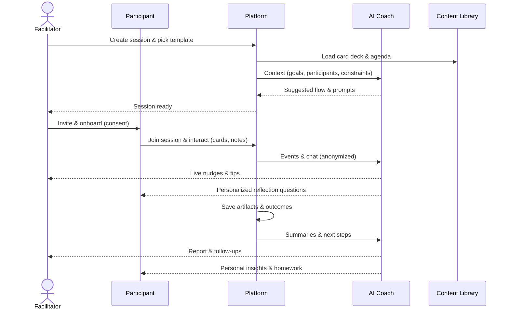

# Typical live session (sequence)

Owner: Miron Krokhmal

```mermaid

sequenceDiagram
  actor F as Facilitator
  participant P as Participant
  participant X as Platform
  participant AI as AI Coach
  participant Lib as Content Library

  F->>X: Create session & pick template
  X->>Lib: Load card deck & agenda
  X->>AI: Context (goals, participants, constraints)
  AI-->>X: Suggested flow & prompts
  X-->>F: Session ready

  F->>P: Invite & onboard (consent)
  P->>X: Join session & interact (cards, notes)
  X->>AI: Events & chat (anonymized)
  AI-->>F: Live nudges & tips
  AI-->>P: Personalized reflection questions

  X->>X: Save artifacts & outcomes
  X->>AI: Summaries & next steps
  AI-->>F: Report & follow-ups
  AI-->>P: Personal insights & homework

```